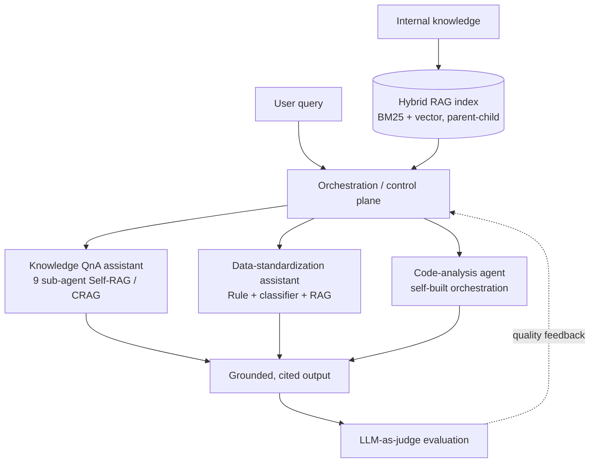

<a href="/projects/1_ai_platform/">English</a> · <strong>한국어</strong>

> 아키텍처와 방법론은 상위 수준으로만 기술한다. 운영 코드와 내부 데이터는 비공개다.

**역할:** 기술 리드 / 아키텍트 &nbsp;·&nbsp; **스택:** Python, LangChain, LangGraph, Azure OpenAI, Azure AI Search, FastAPI

도메인 특화 **멀티 에이전트 RAG 플랫폼**을 아키텍처부터 총괄 설계·구축하고, 단일 에이전트 파일럿에서 전사 과제로 확장했다. 파편화된 내부 지식을 인용 가능한 어시스턴트로 바꾸며, **지식 QnA·데이터 표준화 도우미·코드 분석** 등 여러 협업 sub-agent가 Azure 공유 인프라 위에서 동작한다.

### 주요 성과

- **지식 QnA 챗봇** — 9개 sub-agent **Self-RAG / CRAG** 루프 + 토큰 스트리밍 + 출처 인용. 10개 운영 지표 전수 통과: 사용자 만족도 ~98%, 평균 응답 **4.66초**, 인용률 96.9%, 시스템 성공률 100%. 4모델 **LLM-as-judge** 평가에서 사실성·추론 5.0/5.0.
- **데이터 표준화 도우미 Agent** — Rule + ALBERT 분류기 + RAG 하이브리드(LangGraph Reflexion 루프)로 메타데이터 자동 추천. 10개 지표 전수 통과: 만족도 **90.4%**, 평균 3.75초, fallback 0%.
- **자체 오케스트레이션 vs 범용 CLI** — 최상위 구성에서 건당 비용 **최대 ~17배 절감**, paired t-test / McNemar / Cohen's d / bootstrap CI 6지표 Composite로 검증.
- **RAG 파이프라인** — Parent-Child + Contextual Chunking, 하이브리드 검색(BM25 + Vector), Child→Parent 매핑, 리랭킹으로 환각 억제. LangChain → LangGraph → Agentic 3단계 오케스트레이션 로드맵.
- **모델 평가·MLOps** — LLM-as-judge 자동 채점(사실·추론·범위외·멀티턴) + 아키텍처 A/B 벤치마크 + 메트릭 로깅. 클라우드 운영비 추정 대비 **~32% 절감**.

### 아키텍처

플랫폼의 sub-agent들은 공통 기반 — Parent-Child·Contextual Chunking과 리랭킹을 갖춘 하이브리드(BM25 + Vector) RAG 인덱스 — 와 공통 평가 루프를 공유한다. 지식 QnA 어시스턴트는 9개 sub-agent Self-RAG / CRAG 루프로 인용된 답변을 구성하고, 데이터 표준화·코드 분석 에이전트도 동일한 그라운딩·오케스트레이션을 재사용한다. LLM-as-judge 단계가 매 상호작용을 채점해 각 에이전트로 품질 신호를 되먹인다.

오케스트레이션은 LangChain → LangGraph → Agentic 로드맵을 따라, 단일 프레임워크에 종속되지 않으면서 통제면(control plane)의 역량을 키운다.

### 사례 연구 — 자체 오케스트레이션 vs 범용 CLI

**문제.** 범용 CLI 에이전트도 내부 질의에 답할 수 있었지만, 건당 비용 프로파일이 전사 도입으로 확장되지 않았고, "체감상 낫다"는 플랫폼 의사결정의 근거가 될 수 없다.

**바꾼 것.** RAG 파이프라인을 감싸는 전용 오케스트레이션 하네스를 직접 구축해 통제면을 사내에 두고, 6지표 Composite로 범용 CLI와 정면 비교했다 — 데모가 아니라 설계된 실험으로 다뤘다.

| 항목 | 범용 CLI | 자체 오케스트레이션 |
|---|---|---|
| 건당 비용 | 기준 (1×) | 최상위 구성에서 **최대 ~17배 낮음** |
| 판단 근거 | 일화 | paired t-test · McNemar · Cohen's d · bootstrap CI |

**결과.** 답변 품질을 유지하면서 건당 비용 최대 ~17배 절감, 인상이 아니라 통계 검정으로 격차를 입증했다 — 단일 에이전트 파일럿에서 전사 롤아웃으로 넘어가는 근거가 되었다.

### 의의

자체 하네스는 통제면을 사내에 둔다: 벤더 유연성, 비용 통제, 그리고 지식을 단일 공급자에게 빌리는 대신 지속 자산으로 축적한다. 이 주장을 팀 밖에서도 입증했다 — MS 워크숍 2회에서 기술 토론을 주도해 **MS 아키텍트와 엔지니어 7명을 자체 오케스트레이션 방식으로 설득**했다.
