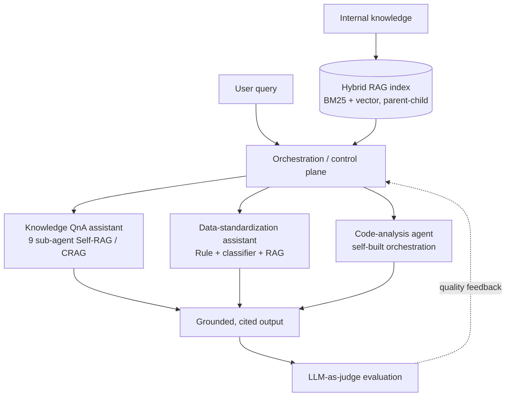
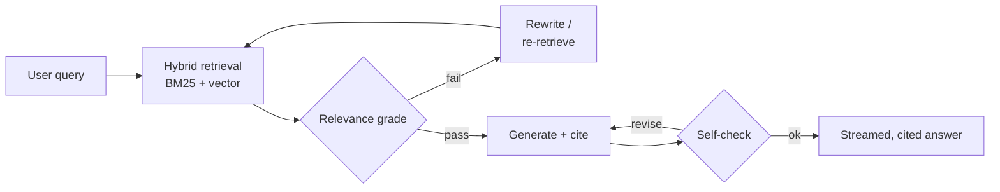
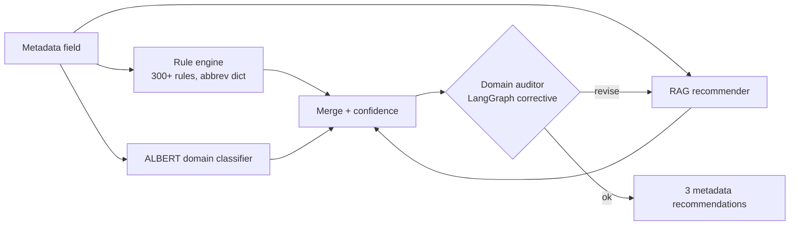
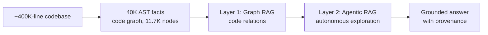



> 아키텍처와 방법론은 상위 수준으로만 기술한다. 운영 코드와 내부 데이터는 비공개다.

**역할:** 기술 리드 / 아키텍트 &nbsp;·&nbsp; **기간:** 2025.11 – 현재 &nbsp;·&nbsp; **스택:** Python, LangChain, LangGraph, Azure OpenAI, Azure AI Search, FastAPI, React

도메인 특화 **멀티 에이전트 RAG 플랫폼**을 아키텍처부터 총괄 설계·구축하고, 단일 에이전트 파일럿에서 전사 과제로 확장했다 — 선행 [데이터 표준화 시스템](/ko/projects/2_data_standardization/)의 성공이 단일 에이전트 계획에서 멀티 에이전트 대형 과제로 승격된 프로젝트다. 파편화된 내부 지식을 인용 가능한 어시스턴트로 바꾸며, **지식 QnA·데이터 표준화 도우미·코드 분석** 등 여러 협업 sub-agent가 Azure 공유 인프라 위에서 동작한다. 현재 초기 현업 실무진 **~30명에 배포**되어 전사 확장 중이며, 3개 에이전트 중 2종을 목표 대비 **2개월 조기 완료**했다.



### 3대 에이전트

  <input type="radio" name="ag-tabs" id="ag-qna" checked>
  <input type="radio" name="ag-tabs" id="ag-std">
  <input type="radio" name="ag-tabs" id="ag-code">
  <nav class="ag-bar" aria-label="플랫폼 에이전트">
    <label for="ag-qna">지식 QnA</label>
    <label for="ag-std">데이터 표준화</label>
    <label for="ag-code">코드 분석</label>
  </nav>

  <section class="ag-panel" id="ag-panel-qna">
    
<strong>지식 QnA 챗봇</strong> — 9개 sub-agent <strong>Self-RAG / CRAG</strong> 루프 + 토큰 스트리밍 + 출처 인용. 질의 <strong>151건</strong> 운영 평가에서 <strong>10개 운영 지표 전수 통과</strong>; 50문항·4모델 <strong>LLM-as-judge</strong> 평가에서 사실성·추론 <strong>5.0 / 5.0</strong>(gpt-4.1).

    

      사용자 질의→
      하이브리드 검색→
      Self-RAG / CRAG 자기검증 루프→
      출처 인용 스트리밍 답변→
      LLM-as-judge 채점
    

    

      

사용자 만족도

~98%

      

평균 응답

4.66초

      

출처 인용률

96.9%

      

RAG 검색 성공률

95.6%

      

시스템 성공률

100%

      

LLM-judge 사실·추론

5.0/5.0

    

  </section>

  <section class="ag-panel" id="ag-panel-std">
    
<strong>데이터 표준화 도우미 Agent</strong> — Rule + ALBERT 분류기 + RAG 하이브리드(LangGraph Reflexion 루프)로 메타데이터 3종 자동 추천; 선행 <a href="/ko/projects/2_data_standardization/">데이터 표준화 시스템</a>의 production 계승체다. 질의 <strong>101건</strong> 평가에서 <strong>10개 운영 지표 전수 통과</strong>.

    

      메타데이터 질의→
      Rule 엔진 · ALBERT 분류기 · RAG 조회→
      병합 추천 + 신뢰도 점수→
      LangGraph Reflexion 검증
    

    

      

사용자 만족도

90.4%

      

평균 응답

3.75초

      

Fallback 비율

0%

      

운영 지표 통과

10/10

    

  </section>

  <section class="ag-panel" id="ag-panel-code">
    
<strong>코드 분석 Agent</strong> — 약 40만 줄 Python 코드베이스(32개 레포, 1,453 파일)를 <strong>40K AST 사실</strong>, 코드 그래프(<strong>11,729 노드 / 38,783 엣지</strong>), 42K 검색 인덱스로 그라운딩. 3-아키텍처 벤치마크 — <strong>raw Claude Code vs Claude Code+메타데이터/스킬 하네스 vs 자체 오케스트레이션</strong>, 9개 변형 — 에서 결정론 우선·그라운딩 기반의 mini급 모델(GPT-5.4-mini) 자체 오케스트레이션이 <strong>종합 1위(Composite 0.977)</strong>, paired t-test / McNemar / Cohen's d / bootstrap CI 6지표 Composite로 검증; 현재 production 배포 임박. 상세 비교는 아래 사례 연구 참조.

    

      약 40만 줄 코드베이스→
      40K AST 사실 · 코드 그래프 · 42K 인덱스→
      GPT-5.4-mini 그라운딩 파이프라인→
      출처 포함 답변
    

    

      

AST 사실

40K

      

코드 그래프 (노드 / 엣지)

11.7K / 38.8K

      

벤치마크 Composite

0.977

9개 변형 중 1위

      

건당 비용

$0.076

최대 ~17배 절감

    

    

      

        최고 비용 CLI 변형
        

        $1.32
      

      

        자체 오케스트레이션
        

        $0.076
      

      동일 51문항 평가 셋 기준 건당 비용 — 최대 ~17배 절감.
    

  </section>

### 플랫폼 공통 기반

- **RAG 파이프라인** — Parent-Child + Contextual Chunking, 하이브리드 검색(BM25 + Vector), Child→Parent 매핑, 리랭킹으로 환각 억제. LangChain → LangGraph → Agentic 3단계 오케스트레이션 로드맵.
- **모델 평가·MLOps** — LLM-as-judge 자동 채점(사실·추론·범위외·멀티턴) + 아키텍처 A/B 벤치마크 + 메트릭 로깅. 클라우드 운영비 추정 대비 **~32% 절감**.

### 아키텍처

플랫폼의 sub-agent들은 공통 기반 — Parent-Child·Contextual Chunking과 리랭킹을 갖춘 하이브리드(BM25 + Vector) RAG 인덱스 — 와 공통 평가 루프를 공유한다. 지식 QnA 어시스턴트는 9개 sub-agent Self-RAG / CRAG 루프로 인용된 답변을 구성하고, 데이터 표준화·코드 분석 에이전트도 동일한 그라운딩·오케스트레이션을 재사용한다. LLM-as-judge 단계가 매 상호작용을 채점해 각 에이전트로 품질 신호를 되먹인다.

```mermaid
flowchart TB
    DOCS[Internal knowledge] --> IDX[(Hybrid RAG index<br/>BM25 + vector, parent-child)]
    Q[User query] --> ORCH[Orchestration / control plane]
    IDX --> ORCH
    ORCH --> A1[Knowledge QnA assistant<br/>9 sub-agent Self-RAG / CRAG]
    ORCH --> A2[Data-standardization assistant<br/>Rule + classifier + RAG]
    ORCH --> A3[Code-analysis agent<br/>self-built orchestration]
    A1 --> OUT[Grounded, cited output]
    A2 --> OUT
    A3 --> OUT
    OUT --> EVAL[LLM-as-judge evaluation]
    EVAL -. quality feedback .-> ORCH
```

오케스트레이션은 LangChain → LangGraph → Agentic 로드맵을 따라, 단일 프레임워크에 종속되지 않으면서 통제면(control plane)의 역량을 키운다.

### 에이전트별 아키텍처

세 에이전트는 RAG 공통 기반을 공유하되 오케스트레이션 전략이 다르다: QnA는 Corrective + Self-RAG, 표준화는 결정론적 Rule 엔진을 RAG 앞에 고정해 자율 판단을 최소화, 코드 분석은 Graph RAG 위에 Agentic RAG를 얹는다.

**지식 QnA — Corrective + Self-RAG**

```mermaid
flowchart LR
    Q[User query] --> R[Hybrid retrieval<br/>BM25 + vector]
    R --> G{Relevance grade}
    G -- fail --> RW[Rewrite /<br/>re-retrieve]
    RW --> R
    G -- pass --> A[Generate + cite]
    A --> SC{Self-check}
    SC -- revise --> A
    SC -- ok --> OUT[Streamed, cited answer]
```

**데이터 표준화 — Rule + ALBERT + RAG 하이브리드**

```mermaid
flowchart LR
    M[Metadata field] --> RULE[Rule engine<br/>300+ rules, abbrev dict]
    M --> CLF[ALBERT domain classifier]
    M --> RAG[RAG recommender]
    RULE --> MRG[Merge + confidence]
    CLF --> MRG
    RAG --> MRG
    MRG --> AUD{Domain auditor<br/>LangGraph corrective}
    AUD -- revise --> RAG
    AUD -- ok --> OUT[3 metadata recommendations]
```

**코드 분석 — 2-Layer RAG, Graph then Agentic**

```mermaid
flowchart LR
    CB[~400K-line codebase] --> IDX[40K AST facts<br/>code graph, 11.7K nodes]
    IDX --> L1[Layer 1: Graph RAG<br/>code relations]
    L1 --> L2[Layer 2: Agentic RAG<br/>autonomous exploration]
    L2 --> OUT[Grounded answer<br/>with provenance]
```

### 사례 연구 — 자체 오케스트레이션 vs Claude Code

**문제.** 범용 CLI 에이전트(Claude Code)도 내부 질의에 답할 수 있었지만, 건당 비용 프로파일이 전사 도입으로 확장되지 않았고, "체감상 낫다"는 플랫폼 의사결정의 근거가 될 수 없다.

**바꾼 것.** **3개 아키텍처** — raw Claude Code, Claude Code+메타데이터/스킬 하네스, 그리고 통제면을 사내에 두는 RAG 파이프라인 전용 자체 오케스트레이션 — 를 **9개 변형**(최신 Claude Sonnet 5 포함)으로 51문항 평가 셋·6지표 Composite에서 정면 비교했다 — 데모가 아니라 설계된 실험으로 다뤘다.

| 순위 | 아키텍처 | 모델(수집) | Composite | 지연(초) | 비용($) |
|---|---|---|---|---|---|
| 1 | **자체 오케스트레이션** | GPT-5.4-mini (API) | **0.977** | 11.6 | **0.076** |
| 2 | Claude Code + 메타/스킬 | Sonnet 4.6 (sub) | 0.875 | 161.6 | 0.66 |
| 3 | Claude Code (raw) | Opus 4.8 (sub) | 0.840 | 110.7 | 0.76 |
| 4 | Claude Code + 메타/스킬 | Haiku 4.5 (sub) | 0.836 | 64.2 | 0.19 |
| 5 | Claude Code (raw) | Sonnet 4.6 (sub) | 0.828 | 95.8 | 0.44 |
| 6 | Claude Code + 메타/스킬 | Opus 4.8 (sub) | 0.823 | 169.2 | 1.32 |
| 7 | Claude Code (raw) | Sonnet 5 (sub) | 0.815 | 108.8 | 0.50 |
| 8 | Claude Code (raw) | Sonnet 5 (int) | 0.800 | — | — |
| 9 | Claude Code (raw) | Haiku 4.5 (sub) | 0.758 | 51.8 | 0.136 |

*Composite = 정확도·무환각·완전성·구조추적·관련성·인용의 가중합. 지연·비용은 질의당 실측이며, 괄호는 응답 수집 채널 — `sub` = 구독형 CLI, `API` = 직접 API, `int` = 인터랙티브(효율 미측정). 자체 오케스트레이션은 단일 그라운딩 API 호출로 응답해 최저 비용·최단 지연이면서 Composite 1위를 차지한다.*

**결과.** 결정론 우선의 자체 오케스트레이션이 종합 우승했다 — 그라운딩된 mini급 모델이 프론티어 CLI 에이전트를 답변 품질에서 앞서면서 건당 비용 최대 ~17배 절감, 인상이 아니라 paired t-test · McNemar · Cohen's d · bootstrap CI로 격차를 입증했다 — 단일 에이전트 파일럿에서 전사 롤아웃으로 넘어가는 근거가 되었다. 우승 파이프라인은 현재 production 배포 임박 단계다.

### 의의

자체 하네스는 통제면을 사내에 둔다: 벤더 유연성, 비용 통제, 그리고 지식을 단일 공급자에게 빌리는 대신 지속 자산으로 축적한다. 이 주장을 팀 밖에서도 입증했다 — MS 워크숍 2회에서 기술 토론을 주도해 **MS 아키텍트와 엔지니어 7명을 자체 오케스트레이션 방식으로 설득**했다.
