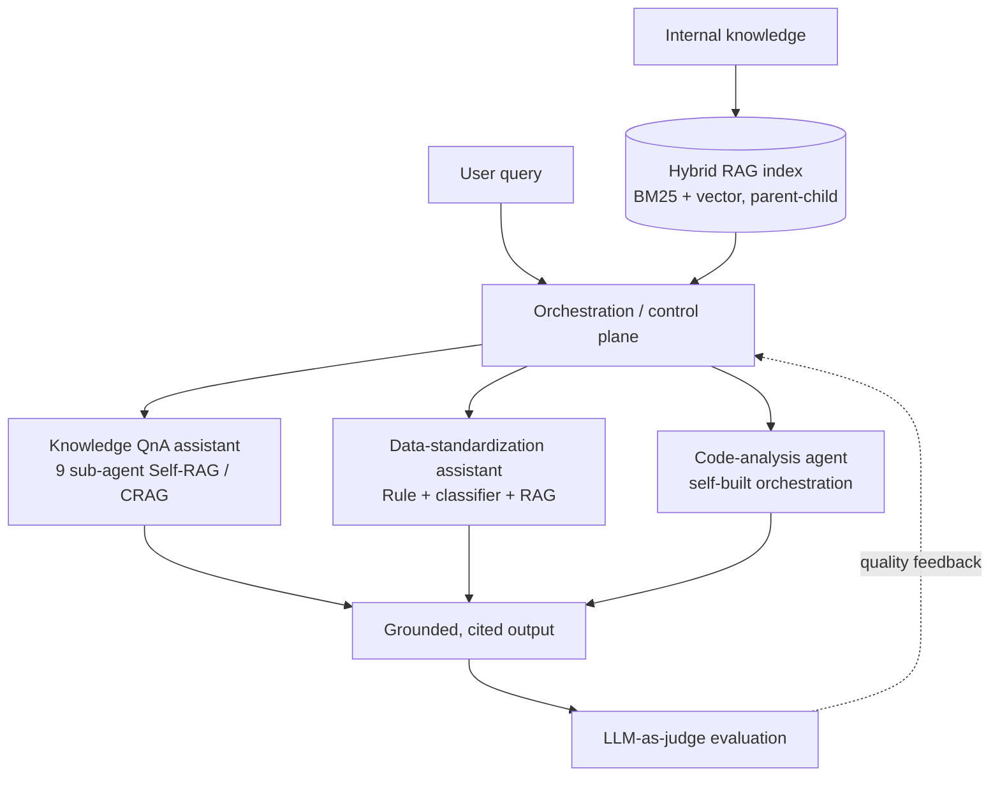

<a href="/projects/1_ai_platform/">English</a> · <strong>한국어</strong>

> 아키텍처와 방법론은 상위 수준으로만 기술한다. 운영 코드와 내부 데이터는 비공개다.

**역할:** 기술 리드 / 아키텍트 &nbsp;·&nbsp; **기간:** 2025.11 – 현재 &nbsp;·&nbsp; **스택:** Python, LangChain, LangGraph, Azure OpenAI, Azure AI Search, FastAPI, React

도메인 특화 **멀티 에이전트 RAG 플랫폼**을 아키텍처부터 총괄 설계·구축하고, 단일 에이전트 파일럿에서 전사 과제로 확장했다 — 선행 [데이터 표준화 시스템](/ko/projects/2_data_standardization/)의 성공이 단일 에이전트 계획에서 멀티 에이전트 대형 과제로 승격된 프로젝트다. 파편화된 내부 지식을 인용 가능한 어시스턴트로 바꾸며, **지식 QnA·데이터 표준화 도우미·코드 분석** 등 여러 협업 sub-agent가 Azure 공유 인프라 위에서 동작한다. 현재 초기 현업 실무진 **~30명에 배포**되어 전사 확장 중이며, 3개 에이전트 중 2종을 목표 대비 **2개월 조기 완료**했다.

### 주요 성과

- **지식 QnA 챗봇** — 9개 sub-agent **Self-RAG / CRAG** 루프 + 토큰 스트리밍 + 출처 인용. 질의 **151건** 운영 평가에서 10개 운영 지표 전수 통과: 사용자 만족도 ~98%, 평균 응답 **4.66초**, 인용률 96.9%, RAG 검색 성공률 95.6%, 시스템 성공률 100%. 50문항·4모델 **LLM-as-judge** 평가에서 사실성·추론 5.0/5.0(gpt-4.1).
- **데이터 표준화 도우미 Agent** — Rule + ALBERT 분류기 + RAG 하이브리드(LangGraph Reflexion 루프)로 메타데이터 3종 자동 추천; 선행 [데이터 표준화 시스템](/ko/projects/2_data_standardization/)의 production 계승체다. 질의 101건 평가에서 10개 지표 전수 통과: 만족도 **90.4%**, 평균 3.75초, fallback 0%.
- **코드 분석 Agent와 3-아키텍처 벤치마크** — 약 40만 줄 Python 코드베이스(32개 레포, 1,453 파일)를 **40K AST 사실**, 코드 그래프(**11,729 노드 / 38,783 엣지**), 42K 검색 인덱스로 그라운딩; **raw Claude Code vs Claude Code+메타데이터/스킬 하네스 vs 자체 오케스트레이션**(11개 변형)을 비교 — 결정론 우선·그라운딩 기반의 mini급 모델(GPT-5.4-mini) 자체 오케스트레이션이 **종합 1위(Composite 0.977)**, 건당 비용 **최대 ~17배 절감**, paired t-test / McNemar / Cohen's d / bootstrap CI 6지표 Composite로 검증; 현재 production 배포 임박.
- **RAG 파이프라인** — Parent-Child + Contextual Chunking, 하이브리드 검색(BM25 + Vector), Child→Parent 매핑, 리랭킹으로 환각 억제. LangChain → LangGraph → Agentic 3단계 오케스트레이션 로드맵.
- **모델 평가·MLOps** — LLM-as-judge 자동 채점(사실·추론·범위외·멀티턴) + 아키텍처 A/B 벤치마크 + 메트릭 로깅. 클라우드 운영비 추정 대비 **~32% 절감**.

### 아키텍처

플랫폼의 sub-agent들은 공통 기반 — Parent-Child·Contextual Chunking과 리랭킹을 갖춘 하이브리드(BM25 + Vector) RAG 인덱스 — 와 공통 평가 루프를 공유한다. 지식 QnA 어시스턴트는 9개 sub-agent Self-RAG / CRAG 루프로 인용된 답변을 구성하고, 데이터 표준화·코드 분석 에이전트도 동일한 그라운딩·오케스트레이션을 재사용한다. LLM-as-judge 단계가 매 상호작용을 채점해 각 에이전트로 품질 신호를 되먹인다.

```mermaid
flowchart TB
    DOCS[Internal knowledge] --> IDX[(Hybrid RAG index<br/>BM25 + vector, parent-child)]
    Q[User query] --> ORCH[Orchestration / control plane]
    IDX --> ORCH
    ORCH --> A1[Knowledge QnA assistant<br/>9 sub-agent Self-RAG / CRAG]
    ORCH --> A2[Data-standardization assistant<br/>Rule + classifier + RAG]
    ORCH --> A3[Code-analysis agent<br/>self-built orchestration]
    A1 --> OUT[Grounded, cited output]
    A2 --> OUT
    A3 --> OUT
    OUT --> EVAL[LLM-as-judge evaluation]
    EVAL -. quality feedback .-> ORCH
```

오케스트레이션은 LangChain → LangGraph → Agentic 로드맵을 따라, 단일 프레임워크에 종속되지 않으면서 통제면(control plane)의 역량을 키운다.

### 사례 연구 — 자체 오케스트레이션 vs Claude Code

**문제.** 범용 CLI 에이전트(Claude Code)도 내부 질의에 답할 수 있었지만, 건당 비용 프로파일이 전사 도입으로 확장되지 않았고, "체감상 낫다"는 플랫폼 의사결정의 근거가 될 수 없다.

**바꾼 것.** **3개 아키텍처** — raw Claude Code, Claude Code+메타데이터/스킬 하네스, 그리고 통제면을 사내에 두는 RAG 파이프라인 전용 자체 오케스트레이션 — 를 **11개 변형**(최신 Claude Sonnet 5를 raw·메타데이터 하네스 양쪽 포함)으로 51문항 평가 셋·6지표 Composite에서 정면 비교했다 — 데모가 아니라 설계된 실험으로 다뤘다.

| 아키텍처 | 결과 |
|---|---|
| Raw Claude Code | 유능한 기준선; 건당 비용이 전사 규모로 확장 불가(최고 비용 변형 $1.32) |
| Claude Code + 메타데이터/스킬 하네스 | 동일 모델에서 raw 대비 응답 유용성 향상 — 실무자 블라인드 평가로 교차검증 |
| 자체 오케스트레이션 | **Composite 0.977 — 11개 변형 중 종합 1위** · 11.6초 · **$0.076/건 (최대 ~17배 낮음)** — mini급 모델(GPT-5.4-mini) 위의 결정론 우선 그라운딩 |

**결과.** 결정론 우선의 자체 오케스트레이션이 종합 우승했다 — 그라운딩된 mini급 모델이 프론티어 CLI 에이전트를 답변 품질에서 앞서면서 건당 비용 최대 ~17배 절감, 인상이 아니라 paired t-test · McNemar · Cohen's d · bootstrap CI로 격차를 입증했다 — 단일 에이전트 파일럿에서 전사 롤아웃으로 넘어가는 근거가 되었다. 우승 파이프라인은 현재 production 배포 임박 단계다.

### 의의

자체 하네스는 통제면을 사내에 둔다: 벤더 유연성, 비용 통제, 그리고 지식을 단일 공급자에게 빌리는 대신 지속 자산으로 축적한다. 이 주장을 팀 밖에서도 입증했다 — MS 워크숍 2회에서 기술 토론을 주도해 **MS 아키텍트와 엔지니어 7명을 자체 오케스트레이션 방식으로 설득**했다.
