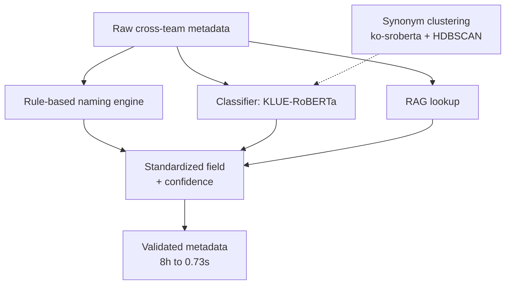

<a href="/projects/2_data_standardization/">English</a> · <strong>한국어</strong>

**역할:** 기술 리드 (IT/BT 20여 명 멘토링) &nbsp;·&nbsp; **스택:** Python, PyTorch, Transformers, KLUE-RoBERTa, BiLSTM, HDBSCAN, RAG, pytest, Docker

현업의 메타데이터 불일치 문제를 정의하고 **NLP 기반 데이터 표준화 시스템**을 총괄 구축했다. 파일럿 성공 후 전사 적용으로 전환됐고, 이후 AI 에이전트 플랫폼으로 확장된 대형 과제의 출발점이 되었다.

### 주요 성과

- **운영 임팩트** — 검증 시간 **8시간 → 0.73초(99% 단축)**, 부서 간 문의 월 70 → 4건(94.3%↓), 메타데이터 일관성 8.4% → 98.7%, 완전성 29.6% → 100%.
- **8개 모델 분류기 벤치마크** — KLUE-RoBERTa, XLM, KoBERT, ALBERT, mBERT, BiLSTM, DistilKoBERT, e5를 동일 조건(14클래스, 7,698건, stratified)·95% CI·McNemar+Holm(28쌍)으로 비교. **KLUE-RoBERTa 96.88%로 최고**; 5-fold CV로 **671K 파라미터 BiLSTM이 110M 모델과 통계적 동급**(96.18% ± 0.41%, paired t-test p=0.73)임을 입증해 1.48ms 경량 배포안 도출.
- **학습데이터 엔지니어링** — LLM / 규칙 / RAG 3소스 9,168건 → 라벨 정규화, 충돌 29건 식별, 중복 제거 → 7,698건 큐레이션.
- **재현 가능한 ML** — 규칙 기반 명명 엔진, 유사어 클러스터링(ko-sroberta + HDBSCAN, 2,048 → 569 클러스터), pytest · GitHub Actions CI · Docker.

### 아키텍처

각 메타데이터 필드를 세 가지 병렬 신호 — 규칙 기반 명명 엔진, 미세조정 분류기, RAG 조회 — 로 처리한 뒤 신뢰도 점수와 함께 표준 필드로 병합한다. 유사어 클러스터링이 분류기와 규칙이 참조하는 표준 용어사전을 구축한다.

