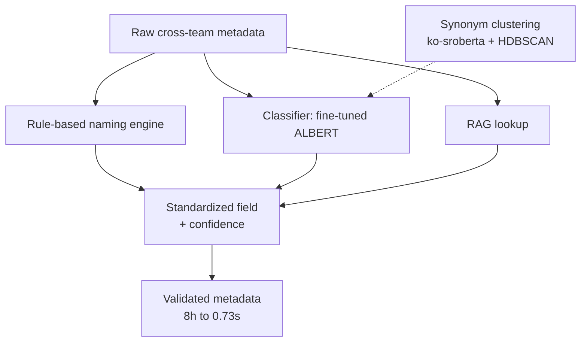
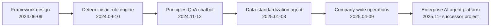



> 아키텍처와 방법론은 상위 수준으로만 기술한다. 운영 코드와 내부 데이터는 비공개다.

**역할:** 기술 리드 — 표준화 체계 설계 단계(2024.06~09)엔 Data Architect, 이후 Data Scientist / AI Engineer로 자동화 구현·운영; IT/BT 20여 명 교육 &nbsp;·&nbsp; **기간:** 2024.06 – 2025.09 &nbsp;·&nbsp; **스택:** Python, PyTorch, Transformers, KLUE-RoBERTa, BiLSTM, HDBSCAN, RAG, pytest, Docker

현업의 메타데이터 불일치를 **문제 정의부터** 시작해 **NLP 기반 데이터 표준화 시스템**을 총괄 구축했다 — 주어진 요구사항이 아니라 스스로 정의한 문제였다. 운영 시스템 3개의 거버넌스 베이스라인 진단에서 컬럼 명명 준수율이 **8.4%**로 측정되어, 막연한 불편이 정량화된 과제로 바뀌었다. 파일럿 성공 후 전사 적용으로 승격됐고, 이후 [엔터프라이즈 AI 에이전트 플랫폼](/ko/projects/1_ai_platform/)으로 확장된 대형 과제의 출발점이 되었다.



### 주요 성과

- **운영 임팩트** — 검증 시간 **8시간 → 0.73초(99% 단축)**, 부서 간 문의 월 70 → 4건(94.3%↓), 메타데이터 일관성 8.4% → 98.7%, 완전성 29.6% → 100% — 추정치가 아니라 사용자 설문과 운영 측정값이다.
- **8개 모델 분류기 벤치마크** — KLUE-RoBERTa, XLM, KoBERT, ALBERT, mBERT, BiLSTM, DistilKoBERT, e5를 동일 조건(14클래스, 7,698건, stratified)·95% CI·McNemar+Holm(28쌍)으로 비교. **KLUE-RoBERTa 96.88%로 최고**였으나 상위 5개 트랜스포머가 통계적 동률 — 결정 기준을 리더보드에서 배포 제약으로 옮겨 **ALBERT**를 production에 배포했다. 5-fold CV로 **671K 파라미터 BiLSTM이 110M 모델과 통계적 동급**(96.18% ± 0.41%, paired t-test p=0.73)임을 입증해 1.48ms 경량 배포안도 확보했다.
- **강건성 검증 5종 독립 프로브** — 5-fold CV, suffix ablation(접미 형태소 제거 시 정확도 −51%p), RAG holdout(합성 데이터 과적합 가설 기각), 소스별 오류분석, 노이즈 플로어 추정 — 정확도 상한이 모델이 아니라 데이터의 한계임을 진단했다.
- **학습데이터 엔지니어링** — LLM / 규칙 / RAG 3소스 9,168건 → 라벨 정규화, 충돌 29건 식별, 중복 1,466건 제거 → 7,698건 큐레이션.
- **재현 가능한 ML** — 규칙 기반 명명 엔진(규칙 14개 + 물리명/약어 자동 생성: 4개 생성·3개 중복해소 전략), 유사어 클러스터링(ko-sroberta + HDBSCAN, 2,048 → 569 클러스터), pytest · GitHub Actions CI · Docker.

### 왜 사지 않고 만들었나

상용 데이터 거버넌스 솔루션 — Databricks, Snowflake, MS Purview — 을 먼저 다각도로 검토했다. 전부 *적용 도구*였다: 이미 갖춰진 표준화 체계를 집행·운영하는 도구이지, 정작 없는 것 — 조직 특화 명명 규칙, 표준 용어사전, 도메인 사전 — 을 제공하지 않았다. 이 간극을 파고든 끝에 프로젝트의 핵심 결론을 귀납적으로 도출했다: **해결의 백본은 데이터 표준화 체계 그 자체다.**

그래서 체계가 먼저였다 — 명명 규칙과 단어/용어/도메인 사전을 명시적 거버넌스 산출물로 설계(2024.06~09)한 뒤 자동화가 뒤따랐다: 결정론 규칙 기반 표준화 엔진(2024.09~10), 그 위에 NLP 지원 계층.

### 아키텍처

각 메타데이터 필드를 세 가지 병렬 신호 — 규칙 기반 명명 엔진, 미세조정 분류기, RAG 조회 — 로 처리한 뒤 신뢰도 점수와 함께 표준 필드로 병합한다. 유사어 클러스터링이 분류기와 규칙이 참조하는 표준 용어사전을 구축한다. production 분류기는 **ALBERT**다: 벤치마크 우승 모델과 배포 모델이 의도적으로 다르다(아래 사례 연구 참조).

```mermaid
flowchart TB
    IN[Raw cross-team metadata] --> RULE[Rule-based naming engine]
    IN --> CLF[Classifier: fine-tuned ALBERT]
    IN --> RAG[RAG lookup]
    RULE --> STD[Standardized field<br/>+ confidence]
    CLF --> STD
    RAG --> STD
    SYN[Synonym clustering<br/>ko-sroberta + HDBSCAN] -.-> CLF
    STD --> OUT[Validated metadata<br/>8h to 0.73s]
```

### 사례 연구 — 설계된 실험으로서의 모델 선정

**문제.** 14-클래스 도메인 분류기는 파이프라인의 중심에 있고, 잘못된 라벨은 모든 다운스트림 시스템으로 조용히 전파된다. "데모가 정확해 보인다"는 이 결정의 근거가 될 수 없다.

**수행.** 8개 모델을 동일 조건(14클래스, 큐레이션 7,698건, stratified 분할)에서 95% 신뢰구간과 전체 28개 모델 쌍에 대한 McNemar 검정(Holm 보정)으로 비교했다. KLUE-RoBERTa가 96.88%로 1위였으나 상위 5개 트랜스포머는 통계적으로 구분 불가 — 리더보드만으로는 결정할 수 없었다. 기준을 배포 제약으로 옮겨 경량 **ALBERT**를 production에 배포했고, 5-fold CV 분석으로 **671K 파라미터 BiLSTM이 110M 파라미터 트랜스포머와 통계적 동급**(96.18% ± 0.41%, paired t-test p=0.73)임을 추가 입증해 1.48ms 경량 옵션을 확보했다.

**진단.** 독립 강건성 프로브 5종 — 5-fold CV, suffix ablation(접미 형태소 제거 시 −51%p), RAG holdout, 소스별 오류분석, 노이즈 플로어 추정 — 이 하나의 결론으로 수렴했다: 잔여 오류는 모델 용량이 아니라 데이터가 만든 상한이다. 이 진단이 이후 투자를 더 큰 모델이 아닌 학습데이터 큐레이션으로 돌렸고, 실제 성과도 거기서 나왔다.

### 표준화 체계에서 에이전트 플랫폼으로

시스템은 스크립트에서 멈추지 않았다. 표준화 원칙을 QnA 챗봇(2024.11~12)으로, 이어서 위의 Rule + ALBERT + RAG 하이브리드인 **데이터 표준화 Agent**(2025.01~03)로 패키징했고, 전사 운영·고도화(2025.04~09)를 거쳤다. 그 성공이 [엔터프라이즈 멀티 에이전트 RAG 플랫폼](/ko/projects/1_ai_platform/)(2025.11~, 별도 프로젝트)으로 승격됐고, 표준화 Agent는 현재 그 플랫폼의 3대 production 에이전트 중 하나로 동작한다.

```mermaid
flowchart LR
    F[Framework design<br/>2024.06-09] --> R[Deterministic rule engine<br/>2024.09-10]
    R --> Q[Principles QnA chatbot<br/>2024.11-12]
    Q --> A[Data-standardization agent<br/>2025.01-03]
    A --> O[Company-wide operations<br/>2025.04-09]
    O --> P[Enterprise AI agent platform<br/>2025.11- successor project]
```

### 의의

자동화는 자동화 대상이 잘 정의되어 있을 때만 작동한다. 이 프로젝트의 지속 자산은 표준화 체계 — IT/BT 20여 명이 교육받은 규칙·사전·거버넌스 프로세스 — 이고, NLP 시스템은 그 전달 수단이다. 문제를 이렇게 프레이밍한 것이 파일럿을 전사 롤아웃으로 확장시켰고, 이후 엔터프라이즈 AI 에이전트 플랫폼의 씨앗이 되었다.
