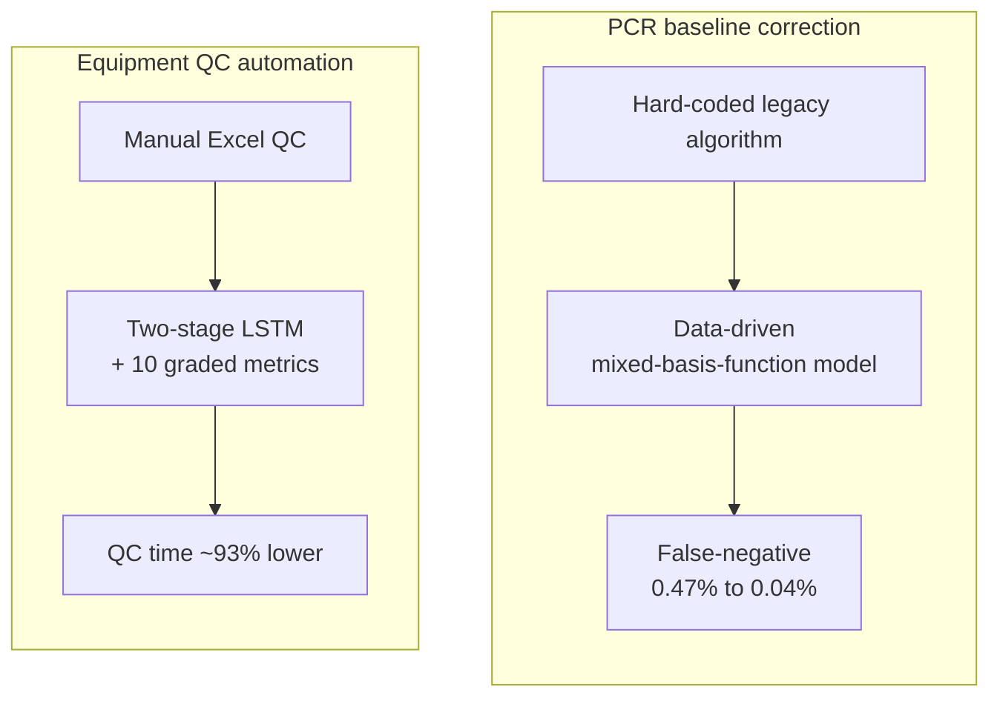

<a href="/projects/3_diagnostics_ml/">English</a> · <strong>한국어</strong>

**역할:** 프로젝트 PM / 데이터 사이언티스트 &nbsp;·&nbsp; **스택:** Python, R, LSTM, 선형/기저함수 모델링, PCA/t-SNE/DBSCAN, R Shiny

통계적 엄밀성이 측정 가능한 안전성·비용 성과로 이어진 두 개의 진단 프로젝트.

### PCR 신호 baseline 보정

- 하드코딩된 레거시 baseline 알고리즘을 **데이터 기반 혼합 기저함수 모델**로 재설계, 위음성률 **0.47% → 0.04%(91.49% 개선)**.
- 5종 경쟁 알고리즘 대비 잔여신호 백색잡음 근사도 1위; Matlab → Python 리팩터링 + 실시간 선형회귀 최적화.

### 장비 QC 자동화

- 수동 엑셀 QC를 **2단계 LSTM + 10개 등급 성능 지표**로 대체, QC 시간 ~93% 단축(연간 운영비 약 13배 절감).
- 2,201대 장비 / 2,552회 실험 / **61,248개 신호**로 학습: 합/불 분류 94.5%, 등급 분류 82.7%; PCA · t-SNE · DBSCAN · 3시그마 이상탐지 + R Shiny 실시간 대시보드.
- **R&D President's Award** 및 제1발명가 특허 2건.

### 접근

두 프로젝트 모두 수동 또는 하드코딩 baseline을 측정 기반 데이터 주도 모델로 대체했다.

