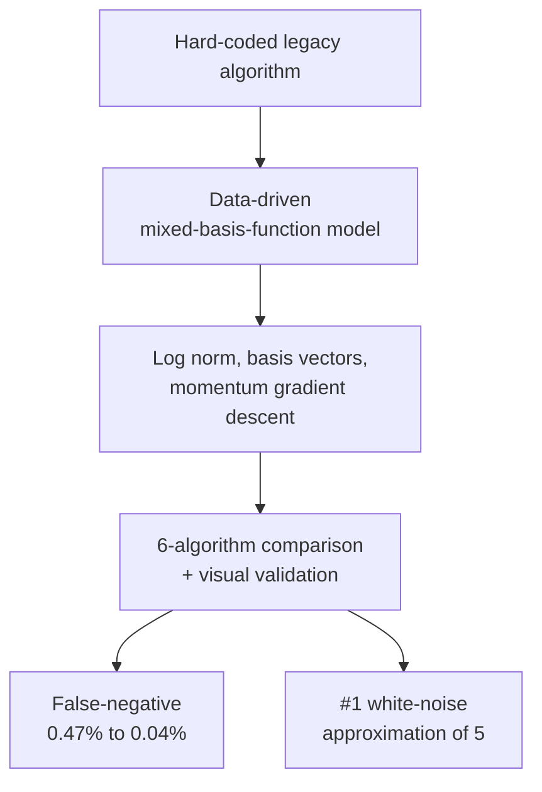

<a href="/projects/3_pcr_baseline/">English</a> · <strong>한국어</strong>

**역할:** 기술 리드 / 데이터 사이언티스트 (Data Scientist 3, Data Engineer 1) &nbsp;·&nbsp; **기간:** 2024.01 – 2024.09 &nbsp;·&nbsp; **스택:** Python, Matlab, 혼합 기저함수 모델링, 경량 선형회귀

하드코딩된 레거시 PCR 신호 보정 알고리즘을 **데이터 기반 혼합 기저함수 모델**로 재설계하는 과제를 총괄했다. 화학·광학·기계 반응이 섞인 PCR 신호는 단일 규칙으로 대응할 수 없어, 신호 종류마다 분기 조건이 누적되는 취약한 규칙 스택이었다. 게다가 표준화되지 않은 baseline fitting 알고리즘이 여러 벌 병존해 제품·팀 간 결과가 달랐다.



### 주요 성과

- **데이터 기반 혼합 기저함수 모델** — Taylor Series 다항식 근사에서 착안해 다항식·지수·로그 등 혼합 기저함수로 신호를 변환하는 '특성방정식' 알고리즘을 직접 설계하고, 경량 선형회귀로 baseline을 적합. 기저함수를 추가하는 것만으로 새로운 신호 패턴에 확장 가능 — 조건 분기 추가가 필요 없다.
- **위음성률 0.47% → 0.04% (91.49% 개선)** — 환자 안전성에 직결되는 거짓 음성을 한 자릿수 분의 일 수준으로 낮췄다.
- **5종 경쟁 알고리즘 대비 잔여신호 백색잡음 근사도 1위** — 업계 1위 타사 Black Box 알고리즘과의 직접 성능 비교까지 완료.
- **최소 패키지 정책** — C++ 포팅을 위해 외부 ML/DL 프레임워크 없이(NumPy/Pandas만) 구현, 로그 정규화 → 기저함수 특성 벡터 → 비용함수 → 모멘텀 경사하강 → 예측 → 역정규화 파이프라인 구성.
- **직관적 성능 비교 시각화**(복수 신호·단일 신호·신호 유형별)로 생물학자·임원까지 참여하는 객관적 의사결정을 지원.

### 접근

측정 기반 데이터 주도 모델 하나가 하드코딩 baseline을 대체하고, 파편화된 fitting 알고리즘을 단일화하며, 동일 신호에서 경쟁 알고리즘 대비 품질을 검증한다.

