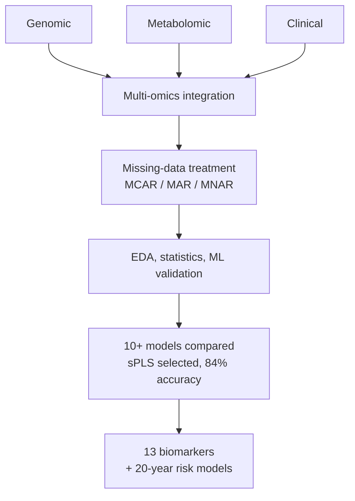

<a href="/projects/4_alzheimers_omics/">English</a> · <strong>한국어</strong>

**역할:** 통계 연구원, Columbia University Irving Medical Center — Taub Institute &nbsp;·&nbsp; **스택:** R, Cox / GEE, sPLS, Lasso/Ridge/RF/SVM/GBM, PCA/K-means/DBSCAN

알츠하이머병 바이오마커 발굴을 위한 **대규모 다중오믹스 분석** 대학원 생물통계 프로젝트.

### 주요 성과

- **유전체·대사체·임상** 데이터를 통합해 약 3,000개 대사물질 중 **핵심 바이오마커 13개(p < 0.01)** 를 규명하고, 8개월간 미발견 교란자를 밝혀냈다.
- 고차원 소표본 환경(**변수 약 3,000개, 표본보다 변수가 훨씬 많은 환경**)을 MCAR/MAR/MNAR 인지 결측 처리와 EDA → 통계 → ML 3단계 검증으로 다뤘다.
- 10+ ML 알고리즘을 비교해 **sPLS 선정**(분류 정확도 84% + 해석력); Cox hazard와 family-based GEE로 20년 발병 위험 모델 구축, GWAS + 대사체 연관성 규명.
- 연구 경진대회 top-3; Chair's Award; Taub Institute 정규직 제안.

### 접근

단계적 파이프라인이 세 데이터 양식을 통합하고, 결측을 명시적으로 처리하며, 탐색적 분석부터 통계·머신러닝까지 결과를 검증한다.

