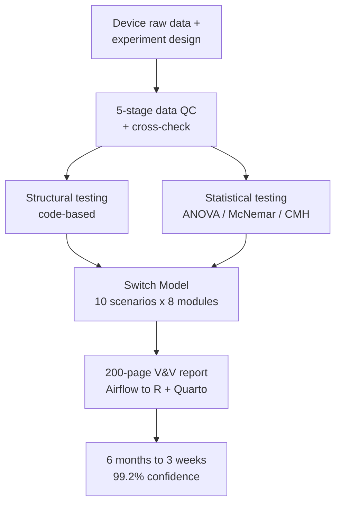



**역할:** 기술 리드 / 데이터 사이언티스트 — 다학제 16명(Data Scientist 3, Data Engineer 2, 생물학자 8, 특허 3) &nbsp;·&nbsp; **기간:** 2023.05 – 2023.12 &nbsp;·&nbsp; **스택:** R, Matlab, Apache Airflow, Quarto, 통계적 검정

진단 제품의 북미 시장 진출을 위해서는 알고리즘 안전성을 소프트웨어 엔지니어링 수준의 테스트를 넘어 **통계적으로 입증**해야 했다 — FDA 인허가가 기존보다 엄격한 Advanced Testing을 요구했기 때문이다. 통계 분석 책임자로서 다음을 수행했다:

- 검증 파이프라인을 **엔드투엔드로 구축**했고,
- 사내 고유 **Switch Model** ablation 방법론을 **개발**했으며,
- **FDA 규제 교육을 주도**해 BT·IT 부서의 규제 이해도를 끌어올렸다.



### 주요 성과

- **검증 기간 6개월 → 3주 (87.5% 단축)**, 통계 신뢰도 **99.2%**로 DSP 알고리즘 안전성 입증.
- **Switch Model** — 사내 고유 ablation 프레임워크(10시나리오 × 8개 핵심 모듈 on/off)로 각 모듈의 Ct·양음성 기여도를 분리 검증, 4가지 신호 위험 관리 모듈의 영향을 정량 분석.
- **2-트랙 검증** — Structural Testing(코드 기반) + Statistical Testing(정성 χ² 적합·연관성, 정량 repeated-measures ANOVA)을 병행, SGS 가이던스(EN 62304) + FDA General Principles of Software Validation 기반.
- **C++ 포팅용 통계 검정** low-level 구현 — 2-Way Repeated Measures ANOVA, McNemar, Breslow-Day, Cochran-Mantel-Haenszel.
- **200페이지 V&V 보고서 반자동 생성** — Airflow(ETL) → R + Quarto 파이프라인, 사내 최초 시약+알고리즘 종합 성능 평가 관리 체계 수립.

### 접근

표준화·QC된 입력 위에서 Structural·Statistical 검증을 결합해 알고리즘 안전성을 통계적으로 입증하고, 보고서 생성을 end-to-end 자동화한다.

