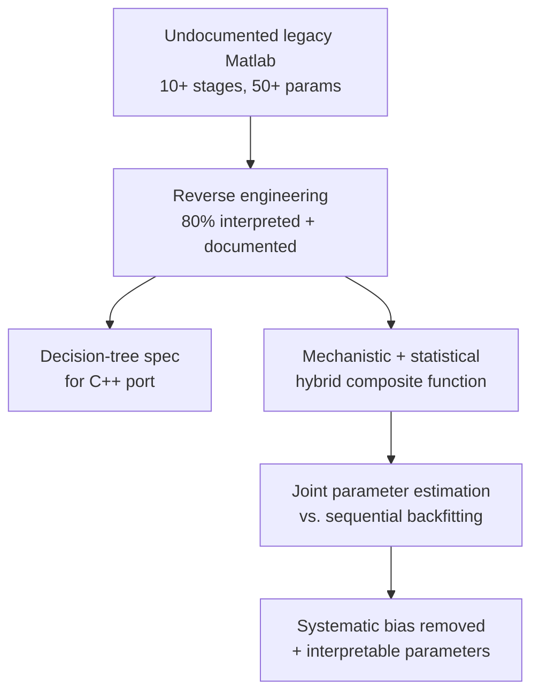

<a href="/projects/5_rtpcr_reverse/">English</a> · <strong>한국어</strong>

**역할:** 데이터 사이언티스트 — 알고리즘 분석·개선안 설계(6인 Data Science 팀) &nbsp;·&nbsp; **기간:** 2021.10 – 2023.04 &nbsp;·&nbsp; **스택:** Matlab, Python, 메카니스틱 + 통계 모델링, 결합추정, 잔차 분석

주석 없는 **레거시 Matlab 알고리즘**(10+단계 보정, 50+ 경험적 파라미터)을 reverse engineering으로 해석하고 통계적으로 엄밀한 개선안을 설계했다. 결정론적 규칙 스택은 노이즈 패턴이 추가될 때마다 조건 분기가 기하급수적으로 늘었고, 단계별 순차 보정은 **systematic bias**를 누적시키며 비선형 상호작용 탓에 민감도 분석이 불가능했다. 규제가 요구하는 설명 가능성을 확보하기 위해 딥러닝 블랙박스 대신 **메카니스틱 + 통계 hybrid**로 재정식화했다.



### 주요 성과

- **레거시 알고리즘의 로직·의존성 80% 해석·문서화** — 조건 분기 구조를 결정 트리 형태로 시각화하고, Data Engineer 팀의 C++ 포팅용 상세 기술 명세서 작성.
- **결합추정(joint estimation) hybrid 모델** — 전처리 함수 3개와 RT-PCR kinetics 로지스틱 시그모이드의 합성함수를 전체 파라미터 동시 최적화로 적합. 순차(backfitting) 추정은 단계별 편향을 누적하지만, 결합추정은 이를 구조적으로 제거한다.
- **잔차의 확률적 특성 명시적 모델링** — 정규분포 가정 + white noise 검정, 결합 목적함수의 닫힌 형태 해석적 gradient(안정성·속도), 물리적 타당 범위에 대한 제약 최적화.
- **정량·판정 통합** — 적합 곡선에서 Ct와 양음성 판정을 동일 통계 모형으로 산출, 곡선 적합·정량·판정을 단일 추정 문제로 통합.
- **(조직적 제약)** 팀장 차원에서 개선안이 채택되지 않음 — 기술 우수성과 조직 수용성 간 균형의 중요성을 학습. 통계적 신호처리·곡선 적합 경험은 이후 [PCR baseline 보정](/ko/projects/3_pcr_baseline/) 과제로 계승되었다.

### 접근

1단계는 레거시 로직을 복원하고, 2단계는 이를 단일 통계 모형으로 재정식화한다 — 파라미터가 해석 가능한 곡선 특성(기울기·변곡점·plateau)에 대응해 규제 근거로 직결된다.

