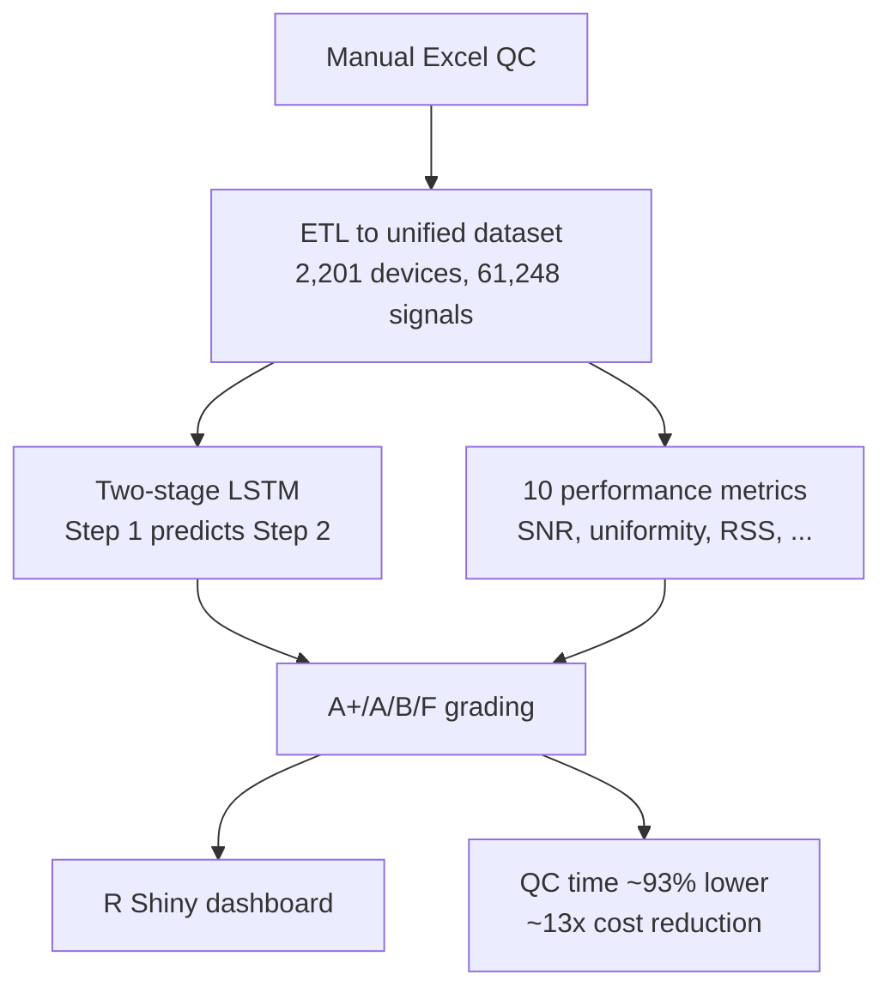

<a href="/projects/6_qc_grading/">English</a> · <strong>한국어</strong>

**역할:** 기술 리드 / 데이터 사이언티스트 — 다학제 11명(Data Scientist 1, Full-stack 3, 기계공학 4, 특허 3) &nbsp;·&nbsp; **기간:** 2020.12 – 2021.09 &nbsp;·&nbsp; **스택:** Python, R, PyTorch (LSTM), PCA/t-SNE/DBSCAN, Isolation Forest, R Shiny

PCR 시약을 타사 장비에 탑재할 때 2단계 QC 프로세스로 장비 성능을 평가한다. 기존 프로세스는 지표 2종·약 100회 표본 일괄평가(신호 1개라도 불합격이면 장비 불합격)의 **수동 엑셀 검사**로, 휴먼 에러에 취약했고 기계 결함과 휴먼 에러를 구별하지 못했다. 나는 이 프로세스의 자동화를 총괄하고 장비를 A+/A/B/F 차등 등급으로 재분류했다.



### 주요 성과

- **QC 시간 ~93% 단축(100대당 400h → 28h)**, 연간 운영비 약 13배 절감(~8억원) — 수동 추적을 자동화 플랫폼으로 대체.
- **2단계 LSTM**으로 Step 1 데이터에서 Step 2 결과를 예측해 Fail 확실 장비만 Step 2 진행 — 2,201대 장비 / 2,552회 실험 / **61,248개 신호**로 학습: 합/불 분류 **94.5%**, 등급 분류 **82.7%**.
- **성능 지표 10종 신규 개발** — 증폭효율, SNR, 기준선 안정성, 광학/온도 균일성, 음성/양성 신호 노이즈, 시계열 분해(trend/seasonal/remainder) 잔차 분산, 이상치 labeling, RSS — 로 A+/A/B/F 등급화(전수 분포: A+ 7.01%, A 12.91%, B 75.72%, F 4.36%).
- **이상탐지** — PCA·t-SNE·DBSCAN·Isolation Forest·3시그마, 업로드 → 자동 분석 → 시각화 R Shiny 실시간 대시보드.
- **R&D 부문 우수상(President's Award)** 및 **제1발명가 특허 2건**; 등급화로 폐기 대신 자원 최적화(A급은 중요 용도, B급은 교육용).

### 접근

ETL로 산재된 엑셀 QC 데이터를 단일화하고, 2단계 LSTM이 Step 1 신호로 Step 2 결과를 예측하며, 10종 지표가 차등 등급을 산출해 대시보드로 노출한다.

