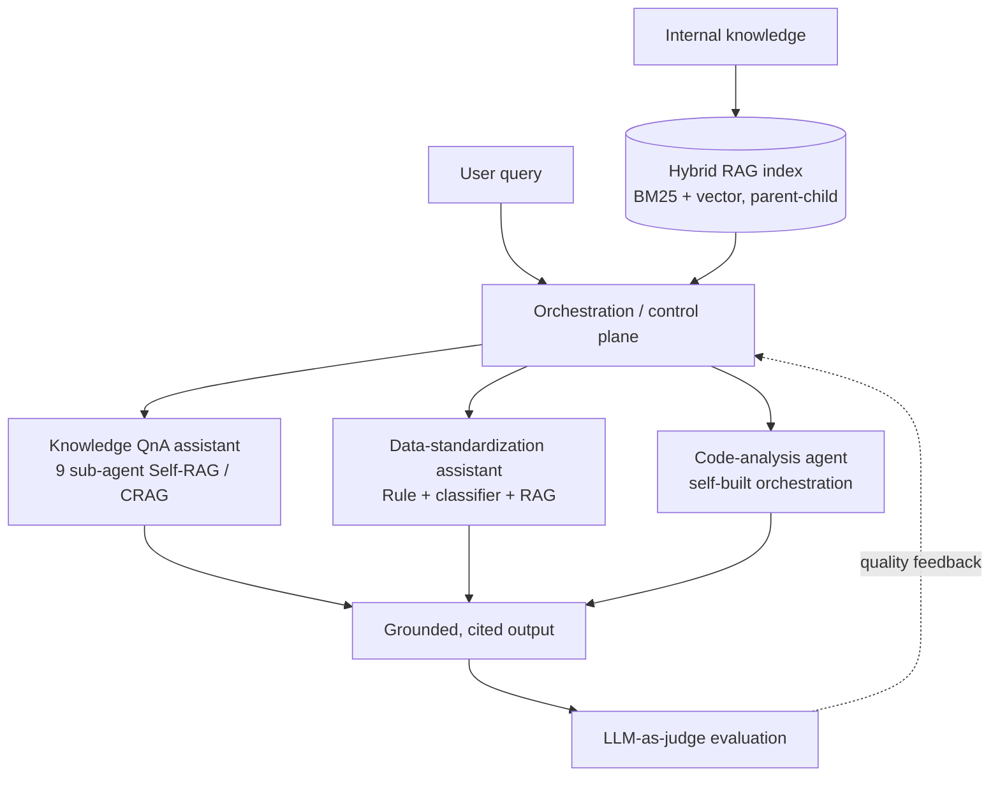

<strong>English</strong> · <a href="/ko/projects/1_ai_platform/">한국어</a>

> Architecture and methodology are described at a high level; production code and internal data are proprietary.

**Role:** Technical Lead / Architect &nbsp;·&nbsp; **Stack:** Python, LangChain, LangGraph, Azure OpenAI, Azure AI Search, FastAPI

I architected an enterprise, domain-specific **multi-agent RAG platform** end-to-end, taking it from a single-agent pilot to a company-wide initiative. The platform turns fragmented internal knowledge into a queryable, cited assistant, and comprises several cooperating sub-agents — a **knowledge QnA assistant**, a **data-standardization assistant**, and a **code-analysis agent** — over shared Azure infrastructure.

### Highlights

- **Knowledge QnA chatbot** — a 9 sub-agent **Self-RAG / CRAG** loop with token streaming and source citation. It passed all 10 operational metrics: ~98% user satisfaction, **4.66s** average response, 96.9% citation rate, 100% system success. A 4-model **LLM-as-judge** evaluation scored 5.0/5.0 on factuality and reasoning.
- **Data-standardization assistant** — a Rule + ALBERT classifier + RAG hybrid (LangGraph Reflexion loop) that auto-recommends metadata fields. It passed all 10 operational metrics: **90.4%** user satisfaction, 3.75s average response, 0% fallback.
- **Self-built orchestration vs. general-purpose CLI** — benchmarked **up to ~17× lower cost per query** at the top-performing configuration, validated with paired t-test / McNemar / Cohen's d / bootstrap CI over a 6-metric composite.
- **RAG pipeline** — Parent-Child + contextual chunking, hybrid search (BM25 + vector), child→parent mapping, and reranking to suppress hallucination; a LangChain → LangGraph → Agentic 3-stage orchestration roadmap.
- **Evaluation & MLOps** — LLM-as-judge auto-scoring (factuality, reasoning, out-of-scope, multi-turn) + architecture A/B benchmarking + metric logging for operations, cutting estimated cloud operating cost by **~32%**.

### Architecture

The platform's sub-agents share a common foundation — a hybrid (BM25 + vector) RAG index with parent-child + contextual chunking and reranking — and a common evaluation loop. The knowledge QnA assistant runs a 9 sub-agent Self-RAG / CRAG loop with token streaming and citation; the data-standardization and code-analysis agents reuse the same grounding and orchestration. An LLM-as-judge stage scores every interaction and feeds quality signals back to each agent.

Orchestration follows a deliberate LangChain → LangGraph → Agentic roadmap, so the control plane grows in capability without locking into a single framework.

### Case study — self-built orchestration vs. a general-purpose CLI

**Problem.** A general-purpose CLI agent could already answer internal questions, but its cost-per-query profile did not scale to company-wide adoption, and "it feels better" is not an argument a platform decision can rest on.

**What changed.** I built a dedicated orchestration harness around the RAG pipeline — keeping the control plane in-house — and benchmarked it head-to-head against the general-purpose CLI on a 6-metric composite, treating the comparison as a designed experiment rather than a demo.

| Dimension | General-purpose CLI | Self-built orchestration |
|---|---|---|
| Cost per query | baseline (1×) | **up to ~17× lower** at the top configuration |
| Decision basis | anecdote | paired t-test · McNemar · Cohen's d · bootstrap CI |

**Result.** Up to ~17× lower cost per query while holding answer quality, with the gap established by statistical tests rather than impression — the evidence that justified moving from a single-agent pilot to a company-wide rollout.

### Why it matters

A self-built harness keeps the control plane in-house: vendor flexibility, cost control, and knowledge captured as a durable asset rather than rented from a single provider. I made this case beyond my own team, too: across two Microsoft workshops I led the technical discussion and persuaded a Microsoft architect and seven engineers of the self-built orchestration approach over a general-purpose Copilot CLI.
