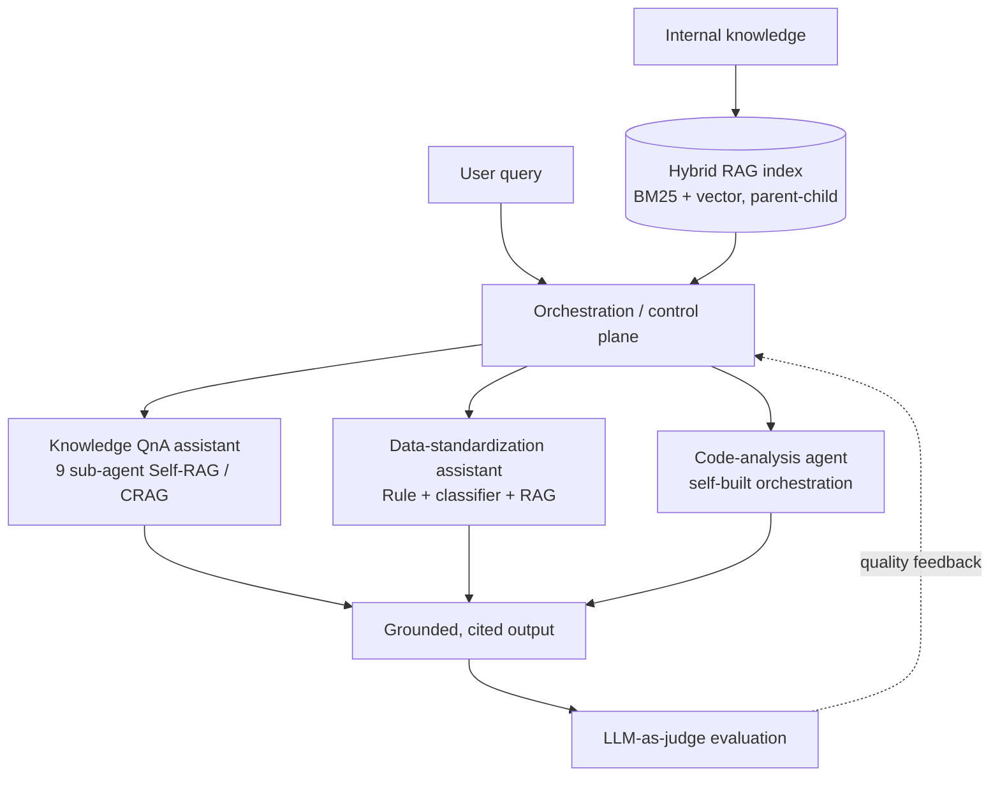
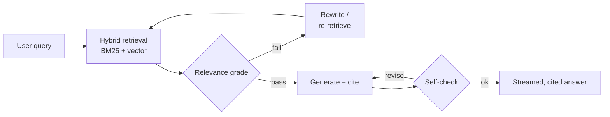
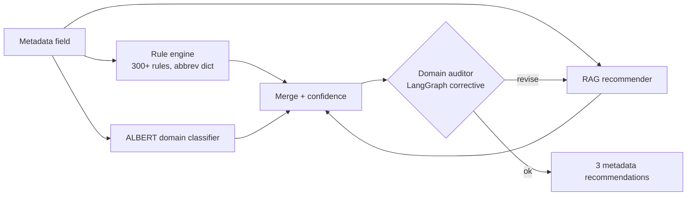
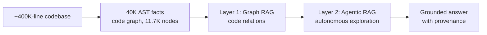



> Architecture and methodology are described at a high level; production code and internal data are proprietary.

**Role:** Technical Lead / Architect &nbsp;·&nbsp; **Period:** 2025.11 – Present &nbsp;·&nbsp; **Stack:** Python, LangChain, LangGraph, Azure OpenAI, Azure AI Search, FastAPI, React

I architected an enterprise, domain-specific **multi-agent RAG platform** end-to-end, taking it from a single-agent pilot to a company-wide initiative — the program grew out of the success of the earlier [data-standardization system](/projects/2_data_standardization/), promoted from a single-agent plan into a multi-agent flagship project. The platform turns fragmented internal knowledge into a queryable, cited assistant, and comprises several cooperating sub-agents — a **knowledge QnA assistant**, a **data-standardization assistant**, and a **code-analysis agent** — over shared Azure infrastructure. It is live with **~30 practitioners** in the initial rollout and expanding company-wide; two of the three agents shipped **two months ahead of target**.



### The three agents

  <input type="radio" name="ag-tabs" id="ag-qna" checked>
  <input type="radio" name="ag-tabs" id="ag-std">
  <input type="radio" name="ag-tabs" id="ag-code">
  <nav class="ag-bar" aria-label="Platform agents">
    <label for="ag-qna">Knowledge QnA</label>
    <label for="ag-std">Data standardization</label>
    <label for="ag-code">Code analysis</label>
  </nav>

  <section class="ag-panel" id="ag-panel-qna">
    
<strong>Knowledge QnA chatbot</strong> — a 9 sub-agent <strong>Self-RAG / CRAG</strong> loop with token streaming and source citation. Across a <strong>151-query</strong> operational evaluation it passed <strong>all 10 operational metrics</strong>; a 50-question, 4-model <strong>LLM-as-judge</strong> evaluation scored <strong>5.0 / 5.0</strong> on factuality and reasoning (gpt-4.1).

    

      User query→
      Hybrid retrieval→
      Self-RAG / CRAG grading loop→
      Cited, streamed answer→
      LLM-as-judge scoring
    

    

      

User satisfaction

~98%

      

Avg response

4.66s

      

Citation rate

96.9%

      

RAG retrieval success

95.6%

      

System success

100%

      

LLM-judge factuality · reasoning

5.0/5.0

    

  </section>

  <section class="ag-panel" id="ag-panel-std">
    
<strong>Data-standardization assistant</strong> — a Rule + ALBERT classifier + RAG hybrid (LangGraph Reflexion loop) that auto-recommends three metadata fields; the productionized successor of the earlier <a href="/projects/2_data_standardization/">data-standardization system</a>. Across a <strong>101-query</strong> evaluation it passed <strong>all 10 operational metrics</strong>.

    

      Metadata query→
      Rule engine · ALBERT classifier · RAG lookup→
      Merged recommendation + confidence→
      LangGraph Reflexion check
    

    

      

User satisfaction

90.4%

      

Avg response

3.75s

      

Fallback rate

0%

      

Operational metrics passed

10/10

    

  </section>

  <section class="ag-panel" id="ag-panel-code">
    
<strong>Code-analysis agent</strong> — grounded a ~400K-line Python codebase (32 repos, 1,453 files) into <strong>40K AST facts</strong>, a code graph (<strong>11,729 nodes / 38,783 edges</strong>), and a 42K search index. A 3-architecture benchmark — <strong>raw Claude Code vs. Claude Code + a metadata/skill harness vs. self-built orchestration</strong>, 9 variants — put the self-built, determinism-first grounded pipeline on a mini-tier model (GPT-5.4-mini) <strong>1st (composite 0.977)</strong>, validated with paired t-test / McNemar / Cohen's d / bootstrap CI over a 6-metric composite; now nearing production deployment. Full comparison in the case study below.

    

      ~400K-line codebase→
      40K AST facts · code graph · 42K index→
      Grounded pipeline on GPT-5.4-mini→
      Answer with provenance
    

    

      

AST facts

40K

      

Code graph (nodes / edges)

11.7K / 38.8K

      

Benchmark composite

0.977

1st of 9 variants

      

Cost per query

$0.076

up to ~17× lower

    

    

      

        Costliest CLI variant
        

        $1.32
      

      

        Self-built orchestration
        

        $0.076
      

      Cost per query on the same 51-question eval set — up to ~17× lower.
    

  </section>

### Platform foundation

- **RAG pipeline** — Parent-Child + contextual chunking, hybrid search (BM25 + vector), child→parent mapping, and reranking to suppress hallucination; a LangChain → LangGraph → Agentic 3-stage orchestration roadmap.
- **Evaluation & MLOps** — LLM-as-judge auto-scoring (factuality, reasoning, out-of-scope, multi-turn) + architecture A/B benchmarking + metric logging for operations, cutting estimated cloud operating cost by **~32%**.

### Architecture

The platform's sub-agents share a common foundation — a hybrid (BM25 + vector) RAG index with parent-child + contextual chunking and reranking — and a common evaluation loop. The knowledge QnA assistant runs a 9 sub-agent Self-RAG / CRAG loop with token streaming and citation; the data-standardization and code-analysis agents reuse the same grounding and orchestration. An LLM-as-judge stage scores every interaction and feeds quality signals back to each agent.

```mermaid
flowchart TB
    DOCS[Internal knowledge] --> IDX[(Hybrid RAG index<br/>BM25 + vector, parent-child)]
    Q[User query] --> ORCH[Orchestration / control plane]
    IDX --> ORCH
    ORCH --> A1[Knowledge QnA assistant<br/>9 sub-agent Self-RAG / CRAG]
    ORCH --> A2[Data-standardization assistant<br/>Rule + classifier + RAG]
    ORCH --> A3[Code-analysis agent<br/>self-built orchestration]
    A1 --> OUT[Grounded, cited output]
    A2 --> OUT
    A3 --> OUT
    OUT --> EVAL[LLM-as-judge evaluation]
    EVAL -. quality feedback .-> ORCH
```

Orchestration follows a deliberate LangChain → LangGraph → Agentic roadmap, so the control plane grows in capability without locking into a single framework.

### Per-agent architecture

The three agents share the RAG foundation but run different orchestration strategies: the QnA assistant is corrective + Self-RAG, the standardization assistant pins a deterministic rule engine ahead of RAG to minimize autonomous judgment, and the code-analysis agent stacks Graph RAG under Agentic RAG.

**Knowledge QnA — corrective + Self-RAG**

```mermaid
flowchart LR
    Q[User query] --> R[Hybrid retrieval<br/>BM25 + vector]
    R --> G{Relevance grade}
    G -- fail --> RW[Rewrite /<br/>re-retrieve]
    RW --> R
    G -- pass --> A[Generate + cite]
    A --> SC{Self-check}
    SC -- revise --> A
    SC -- ok --> OUT[Streamed, cited answer]
```

**Data standardization — Rule + ALBERT + RAG hybrid**

```mermaid
flowchart LR
    M[Metadata field] --> RULE[Rule engine<br/>300+ rules, abbrev dict]
    M --> CLF[ALBERT domain classifier]
    M --> RAG[RAG recommender]
    RULE --> MRG[Merge + confidence]
    CLF --> MRG
    RAG --> MRG
    MRG --> AUD{Domain auditor<br/>LangGraph corrective}
    AUD -- revise --> RAG
    AUD -- ok --> OUT[3 metadata recommendations]
```

**Code analysis — 2-layer RAG, Graph then Agentic**

```mermaid
flowchart LR
    CB[~400K-line codebase] --> IDX[40K AST facts<br/>code graph, 11.7K nodes]
    IDX --> L1[Layer 1: Graph RAG<br/>code relations]
    L1 --> L2[Layer 2: Agentic RAG<br/>autonomous exploration]
    L2 --> OUT[Grounded answer<br/>with provenance]
```

### Case study — self-built orchestration vs. Claude Code

**Problem.** A general-purpose CLI agent (Claude Code) could already answer internal questions, but its cost-per-query profile did not scale to company-wide adoption, and "it feels better" is not an argument a platform decision can rest on.

**What changed.** I benchmarked **three architectures** head-to-head — raw Claude Code, Claude Code wrapped in a metadata/skill harness, and a dedicated self-built orchestration around the RAG pipeline that keeps the control plane in-house — across **9 variants** (including the latest Claude Sonnet 5) on a 51-question eval set with a 6-metric composite, treating the comparison as a designed experiment rather than a demo.

| Rank | Architecture | Model (channel) | Composite | Latency (s) | Cost ($) |
|---|---|---|---|---|---|
| 1 | **Self-built orchestration** | GPT-5.4-mini (API) | **0.977** | 11.6 | **0.076** |
| 2 | Claude Code + meta/skills | Sonnet 4.6 (sub) | 0.875 | 161.6 | 0.66 |
| 3 | Claude Code (raw) | Opus 4.8 (sub) | 0.840 | 110.7 | 0.76 |
| 4 | Claude Code + meta/skills | Haiku 4.5 (sub) | 0.836 | 64.2 | 0.19 |
| 5 | Claude Code (raw) | Sonnet 4.6 (sub) | 0.828 | 95.8 | 0.44 |
| 6 | Claude Code + meta/skills | Opus 4.8 (sub) | 0.823 | 169.2 | 1.32 |
| 7 | Claude Code (raw) | Sonnet 5 (sub) | 0.815 | 108.8 | 0.50 |
| 8 | Claude Code (raw) | Sonnet 5 (int) | 0.800 | — | — |
| 9 | Claude Code (raw) | Haiku 4.5 (sub) | 0.758 | 51.8 | 0.136 |

*Composite = weighted sum of accuracy, no-hallucination, completeness, structure-traceability, relevance, and citation. Latency and cost are per query; the response-collection channel is in parentheses — `sub` = subscription CLI, `API` = direct API, `int` = interactive (efficiency not measured). The self-built orchestration answers in a single grounded API call, so it is both the cheapest and the fastest while topping the composite.*

**Result.** The self-built, determinism-first orchestration won overall — a grounded mini-tier model leading frontier CLI agents on answer quality at up to ~17× lower cost per query, with the gap established by paired t-test · McNemar · Cohen's d · bootstrap CI rather than impression — the evidence that justified moving from a single-agent pilot to a company-wide rollout. The winning pipeline is now nearing production deployment.

### Why it matters

A self-built harness keeps the control plane in-house: vendor flexibility, cost control, and knowledge captured as a durable asset rather than rented from a single provider. I made this case beyond my own team, too: across two Microsoft workshops I led the technical discussion and persuaded a Microsoft architect and seven engineers of the self-built orchestration approach over a general-purpose Copilot CLI.
