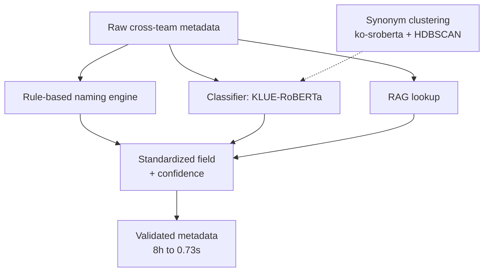

<strong>English</strong> · <a href="/ko/projects/2_data_standardization/">한국어</a>

**Role:** Technical Lead (mentored 20+ engineers across IT/BT) &nbsp;·&nbsp; **Stack:** Python, PyTorch, Transformers, KLUE-RoBERTa, BiLSTM, HDBSCAN, RAG, pytest, Docker

I defined and led an **NLP-based data standardization system** to resolve cross-team metadata inconsistency. A successful pilot was promoted to a company-wide rollout and became the starting point for the later AI agent platform.

### Highlights

- **Operational impact** — validation time **8h → 0.73s (99% reduction)**, cross-team inquiries 70 → 4 per month (94.3%↓), metadata consistency 8.4% → 98.7%, completeness 29.6% → 100%.
- **8-model classifier benchmark** — KLUE-RoBERTa, XLM, KoBERT, ALBERT, mBERT, BiLSTM, DistilKoBERT, e5 compared under identical conditions (14 classes, 7,698 samples, stratified), 95% CI, McNemar + Holm (28 pairs). **KLUE-RoBERTa won at 96.88%**; via 5-fold CV a **671K-param BiLSTM was shown statistically on par with a 110M model** (96.18% ± 0.41%, paired t-test p=0.73), yielding a 1.48ms lightweight deployment option.
- **Training-data engineering** — 9,168 records from LLM / rule / RAG sources → label normalization, 29 conflicts identified, dedup → 7,698 curated.
- **Reproducible ML** — rule-based naming engine, synonym clustering (ko-sroberta + HDBSCAN, 2,048 → 569 clusters), with pytest, GitHub Actions CI, and Docker.

### Architecture

Each metadata field is standardized through three parallel signals — a rule-based naming engine, a fine-tuned classifier, and RAG lookup — merged into a standardized field with a confidence score. A synonym-clustering pass builds the controlled vocabulary the classifier and rules draw on.

