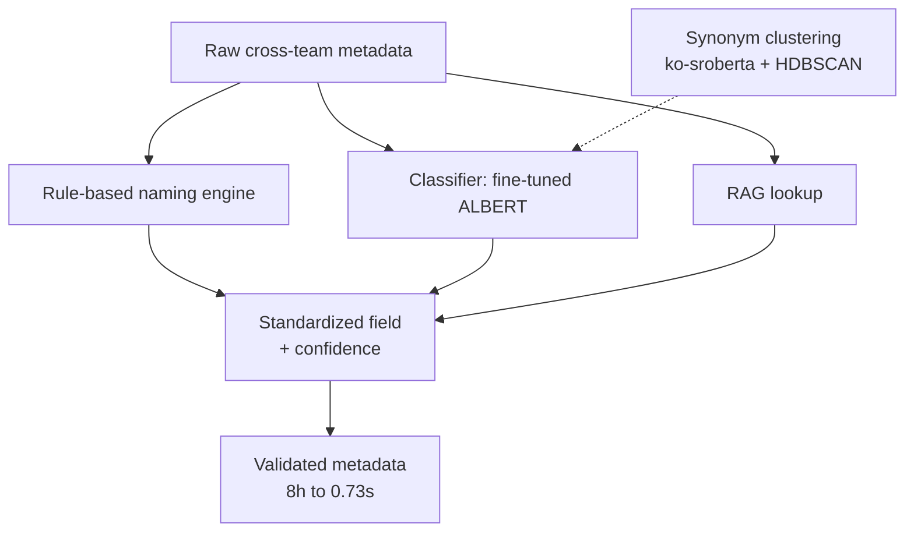
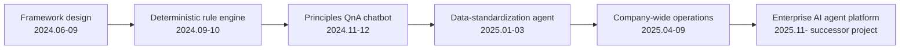



> Architecture and methodology are described at a high level; production code and internal data are proprietary.

**Role:** Technical Lead — Data Architect through the framework-design phase (2024.06–09), then Data Scientist / AI Engineer for automation and operations; trained 20+ engineers across IT/BT &nbsp;·&nbsp; **Period:** 2024.06 – 2025.09 &nbsp;·&nbsp; **Stack:** Python, PyTorch, Transformers, KLUE-RoBERTa, BiLSTM, HDBSCAN, RAG, pytest, Docker

I defined and led an **NLP-based data standardization system** to resolve cross-team metadata inconsistency — starting from problem definition, not from a handed-down requirement. A governance baseline diagnosis across three production systems put column-level naming compliance at **8.4%**, turning a vague pain point into a quantified mandate. A successful pilot was promoted to a company-wide rollout and became the starting point for the later [enterprise AI agent platform](/projects/1_ai_platform/).



### Highlights

- **Operational impact** — validation time **8h → 0.73s (99% reduction)**, cross-team inquiries 70 → 4 per month (94.3%↓), metadata consistency 8.4% → 98.7%, completeness 29.6% → 100% — measured from user surveys and live operations, not projections.
- **8-model classifier benchmark** — KLUE-RoBERTa, XLM, KoBERT, ALBERT, mBERT, BiLSTM, DistilKoBERT, e5 compared under identical conditions (14 classes, 7,698 samples, stratified), 95% CI, McNemar + Holm (28 pairs). **KLUE-RoBERTa won at 96.88%** with the top-5 transformers statistically tied — so the deployment decision moved from the leaderboard to constraints, and **ALBERT** shipped to production. Via 5-fold CV a **671K-param BiLSTM was shown statistically on par with a 110M model** (96.18% ± 0.41%, paired t-test p=0.73), yielding a 1.48ms lightweight deployment option.
- **Robustness validation — 5 independent probes** — 5-fold CV, suffix ablation (accuracy −51%p when suffix morphemes are removed), RAG holdout (rejecting the synthetic-data-overfitting hypothesis), per-source error analysis, and a noise-floor estimate — together diagnosing that the accuracy ceiling was a property of the data, not of the models.
- **Training-data engineering** — 9,168 records from LLM / rule / RAG sources → label normalization, 29 conflicts identified, 1,466 duplicates removed → 7,698 curated.
- **Reproducible ML** — a rule-based naming engine (14 rules + automatic physical-name/abbreviation generation with 4 generation and 3 conflict-resolution strategies), synonym clustering (ko-sroberta + HDBSCAN, 2,048 → 569 clusters), with pytest, GitHub Actions CI, and Docker.

### Why build instead of buy

Commercial data-governance solutions — Databricks, Snowflake, MS Purview — were evaluated first. All of them turned out to be *application* tools: they enforce and operate a standardization framework you already have, and none supply the organization-specific naming rules, controlled vocabulary, and domain dictionaries that were precisely what was missing. Working through that gap produced the project's central, inductively-reached conclusion: **the backbone of the solution is the standardization framework itself.**

So the framework came first — naming rules and word/term/domain dictionaries designed as an explicit governance artifact (2024.06–09) — and automation followed it: a deterministic rule-based standardization engine (2024.09–10), then NLP assistance layered on top.

### Architecture

Each metadata field is standardized through three parallel signals — a rule-based naming engine, a fine-tuned classifier, and RAG lookup — merged into a standardized field with a confidence score. A synonym-clustering pass builds the controlled vocabulary the classifier and rules draw on. The production classifier is **ALBERT**: the benchmark winner and the deployed model differ deliberately (see the case study below).

```mermaid
flowchart TB
    IN[Raw cross-team metadata] --> RULE[Rule-based naming engine]
    IN --> CLF[Classifier: fine-tuned ALBERT]
    IN --> RAG[RAG lookup]
    RULE --> STD[Standardized field<br/>+ confidence]
    CLF --> STD
    RAG --> STD
    SYN[Synonym clustering<br/>ko-sroberta + HDBSCAN] -.-> CLF
    STD --> OUT[Validated metadata<br/>8h to 0.73s]
```

### Case study — model selection as a designed experiment

**Problem.** A 14-class domain classifier sits at the center of the pipeline, and a wrong label propagates silently into every downstream system. "The demo looks accurate" is not a basis for that decision.

**What was done.** Eight models were compared under identical conditions (14 classes, 7,698 curated samples, stratified splits) with 95% confidence intervals and McNemar tests under Holm correction across all 28 model pairs. KLUE-RoBERTa topped the table at 96.88% — but the top-5 transformers were statistically indistinguishable, so the leaderboard alone could not decide. The choice shifted to deployment constraints, and the compact **ALBERT** went to production; a 5-fold-CV analysis additionally showed a **671K-parameter BiLSTM statistically on par with a 110M-parameter transformer** (96.18% ± 0.41%, paired t-test p=0.73), establishing a 1.48ms lightweight option.

**Diagnosis.** Five independent robustness probes — 5-fold CV, suffix ablation (−51%p without suffix morphemes), RAG holdout, per-source error analysis, and a noise-floor estimate — converged on one conclusion: the remaining error was a ceiling set by the data, not by model capacity. That redirected further investment from bigger models to training-data curation, which is where it actually paid off.

### From a standardization framework to an agent platform

The system did not stop at scripts. The standardization principles were packaged as a QnA chatbot (2024.11–12), then as a **data-standardization agent** (2025.01–03) — the Rule + ALBERT + RAG hybrid above — and operated and refined company-wide (2025.04–09). That success was promoted into the [enterprise multi-agent RAG platform](/projects/1_ai_platform/) (2025.11–, a separate project), where the standardization agent now runs as one of its three production agents.

```mermaid
flowchart LR
    F[Framework design<br/>2024.06-09] --> R[Deterministic rule engine<br/>2024.09-10]
    R --> Q[Principles QnA chatbot<br/>2024.11-12]
    Q --> A[Data-standardization agent<br/>2025.01-03]
    A --> O[Company-wide operations<br/>2025.04-09]
    O --> P[Enterprise AI agent platform<br/>2025.11- successor project]
```

### Why it matters

Automation only works when the thing being automated is well defined. The durable asset here is the standardization framework — the rules, dictionaries, and governance process that 20+ engineers across IT/BT were trained on — and the NLP system is its delivery mechanism. Framing the problem that way is what let a pilot scale into a company-wide rollout, and later seed the enterprise AI agent platform.
