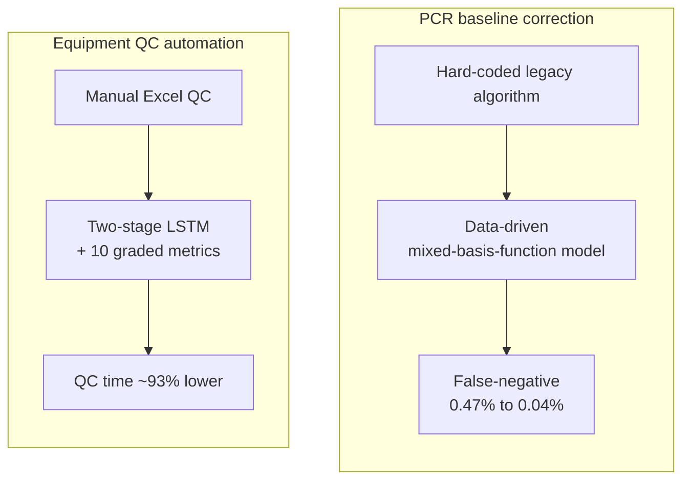

<strong>English</strong> · <a href="/ko/projects/3_diagnostics_ml/">한국어</a>

**Role:** Project PM / Data Scientist &nbsp;·&nbsp; **Stack:** Python, R, LSTM, linear/basis-function modeling, PCA/t-SNE/DBSCAN, R Shiny

Two diagnostics projects where statistical rigor drove measurable safety and cost outcomes.

### PCR signal baseline correction

- Redesigned a hard-coded legacy baseline algorithm into a **data-driven mixed-basis-function model**, cutting the false-negative rate **0.47% → 0.04% (91.49% improvement)**.
- Ranked #1 in residual-signal white-noise approximation against 5 competing algorithms; refactored Matlab → Python with real-time linear-regression optimization.

### Equipment QC automation

- Replaced manual Excel QC with a **two-stage LSTM + 10 graded performance metrics**, cutting QC time ~93% (≈13× annual operating-cost reduction).
- Trained on 2,201 devices / 2,552 runs / **61,248 signals**: pass-fail classification 94.5%, grade classification 82.7%; anomaly detection via PCA, t-SNE, DBSCAN, 3-sigma with an R Shiny real-time dashboard.
- Recognized with an **R&D President's Award** and two first-inventor patents.

### Approach

Both projects replaced a manual or hard-coded baseline with a measured, data-driven model.

