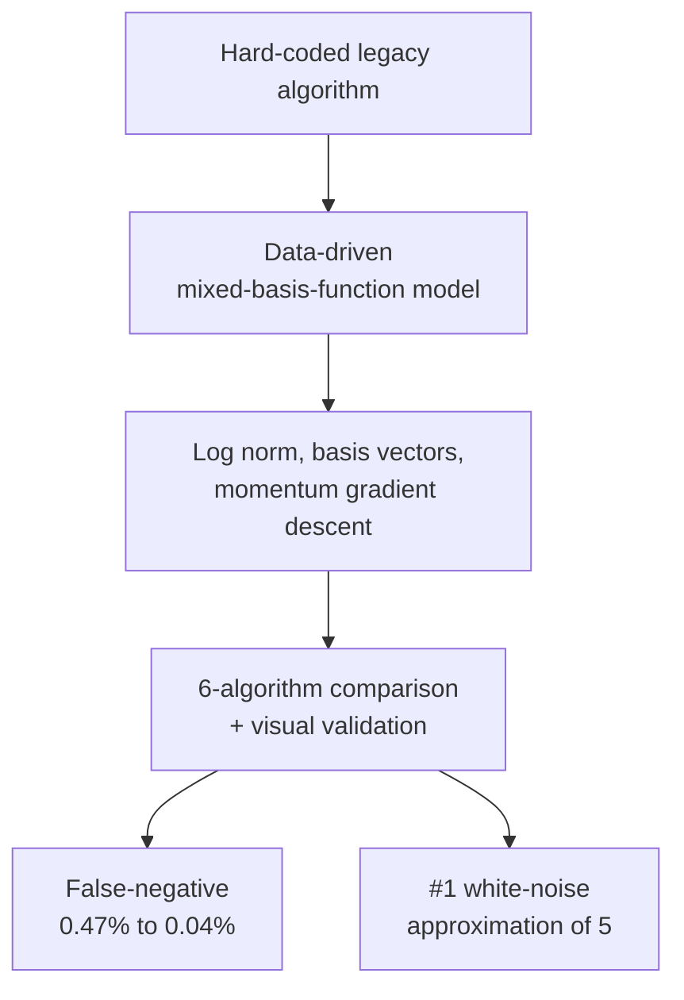

<strong>English</strong> · <a href="/ko/projects/3_pcr_baseline/">한국어</a>

**Role:** Technical Lead / Data Scientist (Data Scientist 3, Data Engineer 1) &nbsp;·&nbsp; **Period:** 2024.01 – 2024.09 &nbsp;·&nbsp; **Stack:** Python, Matlab, mixed-basis-function modeling, lightweight linear regression

I led the redesign of a hard-coded legacy PCR signal-correction algorithm into a **data-driven mixed-basis-function model**, replacing a brittle rule stack that had to branch for every new noise pattern. The signal mixes chemical, optical, and mechanical responses, so a single deterministic rule could not cover it — and multiple non-standard baseline-fitting algorithms coexisted, producing inconsistent results across products and teams.



### Highlights

- **Data-driven mixed-basis-function model** — inspired by Taylor-series polynomial approximation, I designed a "characteristic-equation" algorithm that transforms the signal through mixed polynomial / exponential / log basis functions and fits the baseline with lightweight linear regression. Adding a basis function extends it to a new signal pattern — no new conditional branches.
- **False-negative rate 0.47% → 0.04% (91.49% improvement)** — cutting patient-safety-critical false negatives to a fraction of their prior level.
- **Ranked #1 in residual-signal white-noise approximation** against 5 competing algorithms, including a head-to-head comparison with the industry-leading third-party black-box algorithm.
- **Minimal-package constraint** — implemented without external ML/DL frameworks (NumPy / Pandas only) to keep the pipeline portable to C++, with an optimization pipeline of log normalization → basis-function feature vectors → cost function → momentum gradient descent → prediction → denormalization.
- **Intuitive comparison dashboards** (multi-signal, single-signal, per-signal-type) let biologists and executives take part in objective, evidence-based decisions.

### Approach

A single measured, data-driven model replaces a hard-coded baseline, unifying fragmented fitting algorithms and validating quality against competing methods on the same signals.

