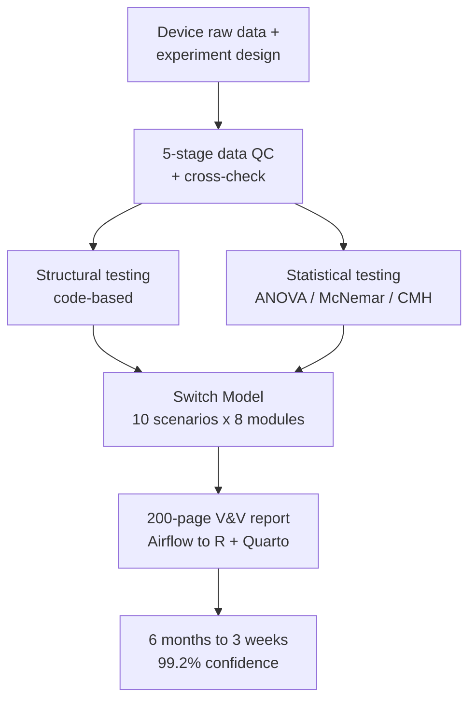



**Role:** Technical Lead / Data Scientist — 16-person cross-functional team (Data Scientist 3, Data Engineer 2, biologists 8, patent 3) &nbsp;·&nbsp; **Period:** 2023.05 – 2023.12 &nbsp;·&nbsp; **Stack:** R, Matlab, Apache Airflow, Quarto, statistical testing

To take a diagnostic product into the North American market, the algorithm's safety had to be **proven statistically**, not just tested at the software-engineering level — FDA clearance required advanced testing beyond the prior process. As statistical-analysis lead I built the validation pipeline, developed the in-house **Switch Model** methodology, and led FDA-regulation training that raised the BT and IT teams' regulatory literacy.



### Highlights

- **Validation cycle 6 months → 3 weeks (87.5% reduction)**, proving DSP-algorithm safety at **99.2% statistical confidence**.
- **Switch Model** — an in-house ablation framework (10 scenarios × 8 core modules on/off) that isolates each module's contribution to Ct and positive/negative calls, quantifying the impact of the four signal-risk-management modules.
- **Two-track testing** — structural (code-based) testing plus statistical testing (χ² goodness-of-fit / association for qualitative, repeated-measures ANOVA for quantitative), aligned to SGS guidance (EN 62304) + the FDA General Principles of Software Validation.
- **C++-port statistical tests** implemented at a low level — 2-way repeated-measures ANOVA, McNemar, Breslow-Day, Cochran-Mantel-Haenszel.
- **200-page V&V report semi-automated** from an Airflow (ETL) → R + Quarto pipeline, establishing the company's first integrated reagent + algorithm performance-evaluation system.

### Approach

A statistical validation system proves algorithm safety by combining structural and statistical testing over standardized, QC'd inputs, with report generation automated end-to-end.

