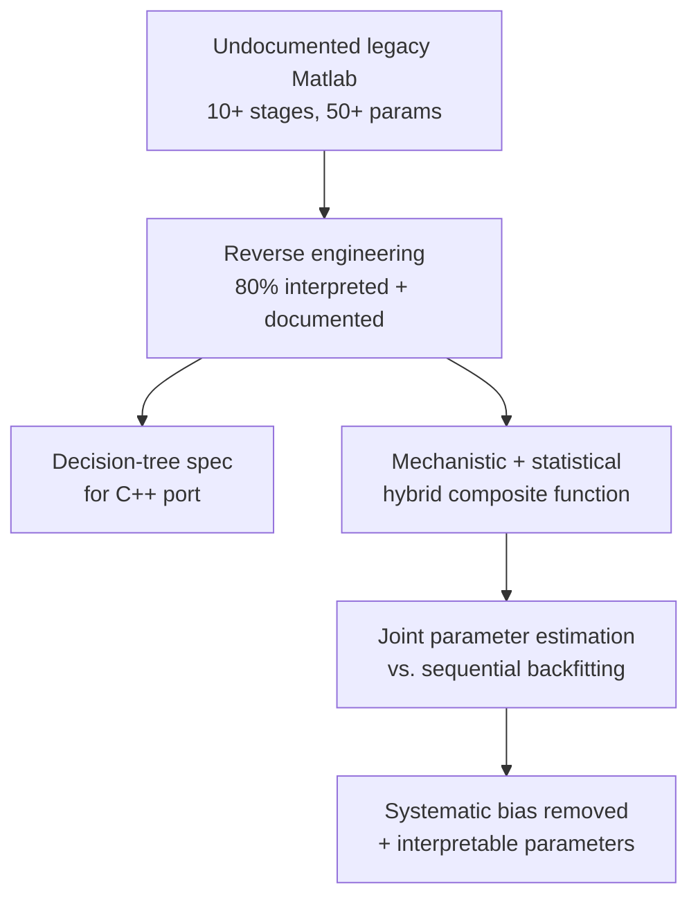



**Role:** Data Scientist — algorithm analysis & redesign (6-person Data Science team) &nbsp;·&nbsp; **Period:** 2021.10 – 2023.04 &nbsp;·&nbsp; **Stack:** Matlab, Python, mechanistic + statistical modeling, joint parameter estimation, residual analysis

Reverse-engineered an **undocumented legacy Matlab algorithm** (10+ correction stages, 50+ empirical parameters) and designed a statistically rigorous replacement.

- **Legacy pain** — the deterministic rule stack grew exponentially with each new noise pattern; stage-by-stage sequential correction accumulated **systematic bias** with non-linear interactions, making sensitivity analysis impossible.
- **Design constraint** — regulatory clearance demanded explainability, so I reframed the problem as a **mechanistic + statistical hybrid** rather than a deep-learning black box.



### Highlights

- **80% of the legacy algorithm's logic and dependencies interpreted and documented** — decision-tree visualizations of the branching structure and a detailed technical spec for the Data Engineering team's C++ port.
- **Joint-estimation hybrid model** — a composite of three preprocessing functions with an RT-PCR-kinetics logistic sigmoid, fit by estimating all parameters simultaneously. Sequential (backfitting) estimation accumulates per-stage bias; joint estimation removes it structurally.
- **Explicit statistical modeling of the residuals** — Gaussian-error assumption with white-noise checks, closed-form analytic gradients for stability and speed, and constrained optimization over physically valid parameter ranges.
- **Unified quantification and calling** — Ct values and positive/negative calls come from the same statistical model, folding curve-fitting, quantification, and calling into a single estimation problem.
- **(Organizational constraint)** the redesign was not adopted at the team-lead level — a lesson in balancing technical excellence against organizational buy-in. The statistical signal-processing and curve-fitting experience carried forward into the later [PCR baseline correction](/projects/3_pcr_baseline/) work.

### Approach

Phase 1 recovers the legacy logic; Phase 2 reformulates it as a single statistical model whose parameters map to interpretable curve features (slope, inflection, plateau) for regulatory justification.

