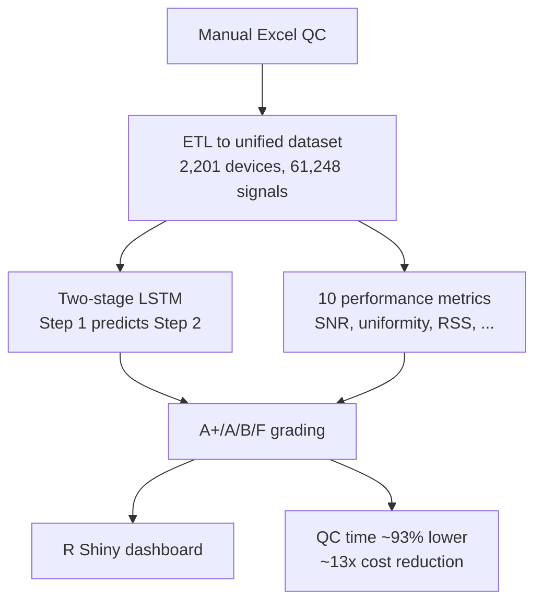



**Role:** Technical Lead / Data Scientist — 11-person cross-functional team (Data Scientist 1, Full-stack 3, mechanical engineers 4, patent 3) &nbsp;·&nbsp; **Period:** 2020.12 – 2021.09 &nbsp;·&nbsp; **Stack:** Python, R, PyTorch (LSTM), PCA/t-SNE/DBSCAN, Isolation Forest, R Shiny

When PCR reagents are deployed onto third-party instruments, a two-stage QC process gauges device performance. I led its automation and re-graded devices on a differentiated A+/A/B/F scale.

- **Legacy process** — **manual Excel inspection**, only two metrics, ~100-sample batch pass/fail where a single failing signal failed the whole device.
- **Failure modes** — fragile to human error, and unable to separate machine defects from operator mistakes.



### Highlights

- **QC time cut ~93% (400h → 28h per 100 devices)** and annual operating cost reduced ~13× (≈₩800M), replacing manual tracking with an automated platform.
- **Two-stage LSTM** predicts Step-2 results from Step-1 data, so only likely-fail devices proceed to Step 2 — trained on **2,201 devices / 2,552 runs / 61,248 signals**: pass/fail classification **94.5%**, grade classification **82.7%**.
- **10 new performance metrics** — amplification efficiency, SNR, baseline stability, optical/thermal uniformity, negative/positive signal noise, time-series decomposition (trend/seasonal/remainder) residual variance, outlier labeling, RSS — driving an A+/A/B/F grade (full fleet: A+ 7.01%, A 12.91%, B 75.72%, F 4.36%).
- **Anomaly detection** via PCA, t-SNE, DBSCAN, Isolation Forest, and the 3-sigma rule, with an R Shiny real-time dashboard for upload → auto-analysis → visualization.
- **R&D President's Award** and **two first-inventor patents**; grading enables resource optimization (A-grade devices to critical use; B-grade for training) instead of scrapping.

### Approach

An ETL pass unifies scattered Excel QC data; a two-stage LSTM predicts Step-2 outcomes from Step-1 signals, and 10 metrics drive a differentiated grade surfaced through a dashboard.

